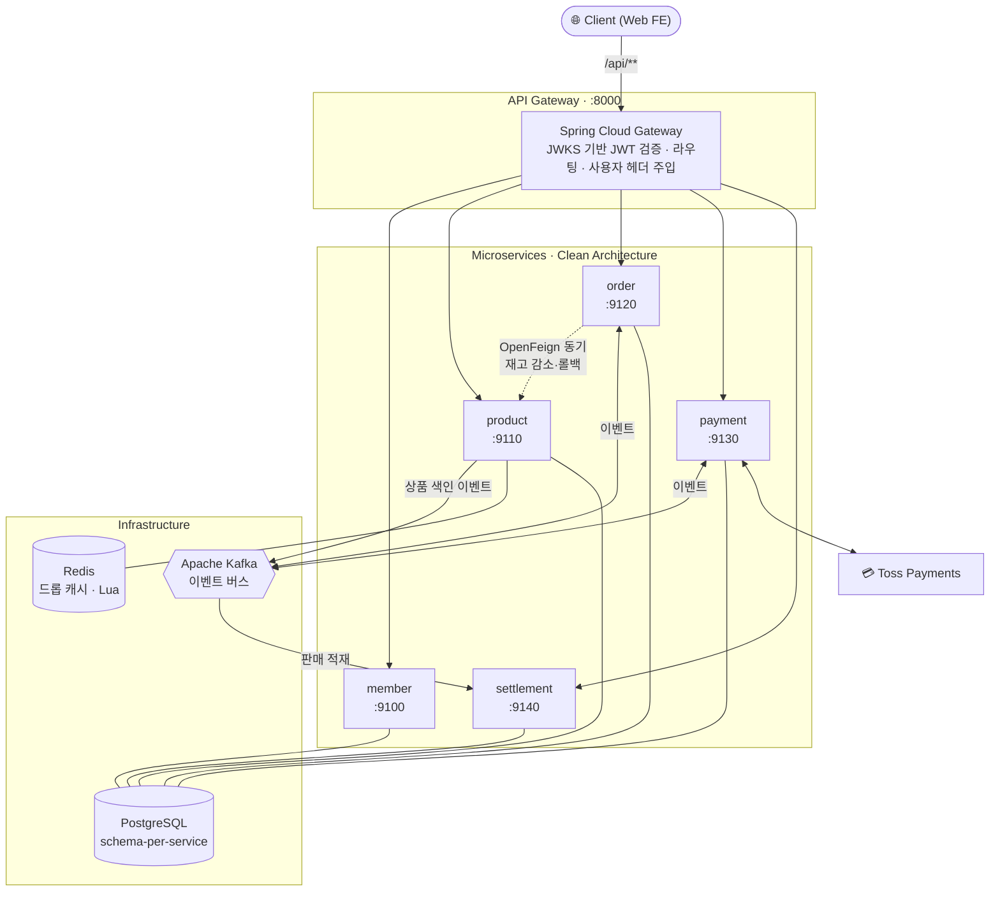
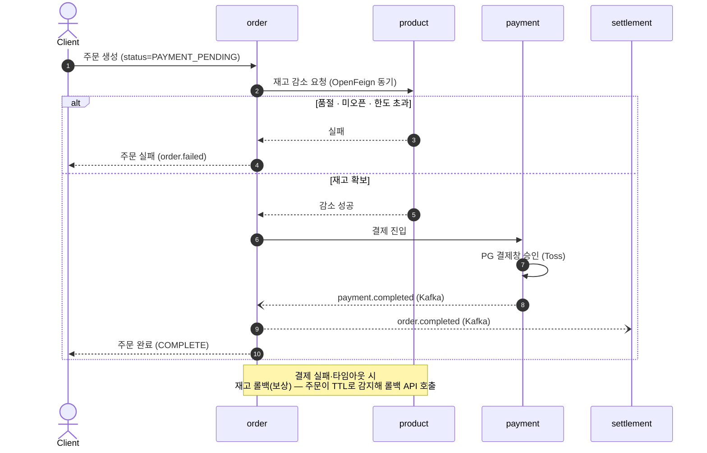

<div align="center">

# 🎟️ openAt

**정해진 시각, 정해진 수량으로 여는 드롭(drop) 커머스 플랫폼**

굿즈와 한정판을 정해진 시각에 한정 수량으로 푼다.
오픈하는 순간 트래픽이 한꺼번에 몰리는데, 그 안에서 재고와 결제를 어긋나지 않게 지켜내는 것이 이 프로젝트의 핵심이다.

<br/>


</div>

---

## 📌 한눈에

- **무엇을** — 한정 수량 드롭 커머스 백엔드. 회원·상품·주문·결제·정산을 각각 독립된 서비스로 나눈 MSA 모노레포다.
- **왜 어려운가** — 드롭이 열리는 순간 같은 상품으로 트래픽이 폭주한다. 재고는 딱 한정 수량만큼만 빠져야 하고, 결제가 실패하면 빠졌던 재고를 다시 되돌려야 한다. 동시성·분산 트랜잭션·결과적 일관성을 정면으로 마주하는 문제다.
- **어떻게 푸는가** — 오픈 순간의 동시 차감은 **Redis + Lua 재고 게이트키퍼**로 한 번에 원자적으로 처리하고, 재고와 결제 사이의 정합성은 **사가(Saga) 오케스트레이션과 보상 트랜잭션**으로 맞춘다.
- **맥락** — 프로그래머스 KDT "Spring AI와 MSA 백엔드" 팀 프로젝트(5인, 1인 1도메인). 여러 기술을 넓고 얕게 훑기보다, 하나를 깊게 파보는 것을 목표로 했다.

---

## 🏗️ 아키텍처

각 서비스는 **클린 아키텍처**(`domain → application → infrastructure / presentation`)를 따르고, 의존성은 언제나 안쪽 도메인을 향한다. 서비스는 자기 데이터만 소유하며, 다른 도메인의 데이터에는 원칙적으로 **API 호출이나 이벤트로만** 접근한다(FK로 묶지 않고 값으로 참조한다). 관리자 집계는 팀이 합의한 예외로 `ai`가 소유하는 읽기 전용 `ai_read` view 계층에만 허용한다.



**통신은 두 갈래로 일부러 나눴다.** 호출의 성격이 다르면 수단도 달라야 한다고 봤기 때문이다.

- **동기 · OpenFeign (`/internal/**`)** — 성공인지 실패인지 그 자리에서 판단해야 하는 호출에 쓴다. 재고 감소·롤백, 이력 조회가 여기 해당한다. 우리 DB를 바로 부르니 빠르고 외부 의존도 없다.
- **비동기 · Kafka 이벤트** — 결과를 기다릴 필요 없이 흘려보내면 되는 전파에 쓴다. 결제·환불 결과, 정산 적재, 상품 색인이 여기 해당한다. PG처럼 느리거나, 끝난 뒤 알려주기만 하면 되는 일들이다.

---

## 🧩 서비스 구성

| 서비스 | 포트 | 책임 |
|---|:---:|---|
| **apigateway** | `8000` | 단일 진입점. JWKS로 JWT 검증·인가, 라우팅, 사용자 헤더 주입, Swagger 통합 |
| **member** | `9100` | 회원가입·로그인·JWT(RS256) 발급, 판매자 등록, **공통 모듈 주도** |
| **product** | `9110` | 상품·드롭 등록/조회, 드롭 상태 관리, **재고 감소·롤백(내부 API)** |
| **order** | `9120` | 주문 요청, **사가 오케스트레이션**, 보상·취소 |
| **payment** | `9130` | PG(토스) 연동, 결제·환불, 결과 이벤트 발행, 민감정보 AES 암호화 |
| **settlement** | `9140` | 이벤트 기반 판매 적재, **Spring Batch** 월 정산 |
| **common** | — | 에러코드·공통 응답·보안 설정·인증 필터 등 서비스 간 계약 |
| `search` · `ai` | _파이널_ | Elasticsearch 하이브리드 검색, 관리자 AI 어시스턴트·RAG·자체 추론 서버 연동 |

> 포트 규칙 — 메인 도메인은 10단위로 올라가고, 파생 서비스는 부모 포트 + 1을 쓴다.

---

## ⚡ 핵심 흐름 — 드롭 즉시 주문 사가

주문 서비스가 **오케스트레이터**가 되어 재고와 결제를 차례로 조율한다. 중간에 어긋나면 **보상 트랜잭션**으로 되돌리고, **멱등키**로 중복 요청과 재시도를 걸러낸다. 2PC는 쓰지 않았다 — 최종적 일관성과 보상으로 푸는 쪽을 택했다.



---

## 🛠️ 기술 스택

| 구분 | 채택 |
|---|---|
| **언어 · 런타임** | Java 21 |
| **프레임워크** | Spring Boot 4.1.0 · Spring Cloud 2025.1.2 |
| **빌드** | Gradle (Kotlin DSL) · 모노레포 멀티모듈 |
| **데이터** | PostgreSQL 16 (공유 DB `openat` + 서비스별 스키마) · Spring Data JPA · QueryDSL · PK는 **UUIDv7** |
| **동시성 · 캐시** | Redis 7 + **Lua 재고 게이트키퍼** (append-only 이력 원장) |
| **통신** | OpenFeign(동기 내부 API) · Apache Kafka(비동기 이벤트) |
| **결제** | Toss Payments(테스트) · 민감정보 **AES-GCM** 암호화 |
| **정산** | Spring Batch + Spring Scheduler (`cron 0 3 5 * *`) |
| **인증 · 보안** | Spring Security · JWT(jjwt 0.12.3, **RS256 + JWKS**) |
| **문서** | springdoc-openapi (Swagger UI) |
| **인프라 · CI/CD** | Docker · GitHub Actions(paths 필터, GHCR) · Terraform(AWS) |
| **부하 테스트** | k6 |
| **파이널 추가** | Elasticsearch · 자체 추론 서버 · 관리자 AI 어시스턴트(MVC SSE · RAG · 외부 도구) |

---

## 💡 설계 하이라이트

<details>
<summary><b>재고 게이트키퍼 — Redis + Lua로 오픈 순간의 동시 차감을 원자화</b></summary>

<br/>

드롭이 열리는 순간 한 상품에 요청이 쏟아지면, DB 락만으로는 처리량이 버티지 못한다.
그래서 잔여 수량을 Redis 캐시에 올려두고, **검사와 차감을 Lua 스크립트 하나의 원자 연산으로** 묶어 품절·한도 초과를 즉시 판정한다. 실제 재고는 **append-only `StockHistory` 이력 원장**을 합산해서 구하므로, 스냅샷 없이도 정확성이 보장된다.

</details>

<details>
<summary><b>사가 오케스트레이션 — 분산 트랜잭션을 보상으로 맞추기</b></summary>

<br/>

주문이 오케스트레이터가 되어 `재고 감소 → 결제`를 순서대로 진행한다.
결제가 실패하거나 타임아웃이 나면, 주문이 **TTL을 기준으로 이를 감지해** 재고 롤백(보상) API를 호출한다. 상품은 롤백 API만 제공할 뿐 타임아웃을 직접 감지하지 않는다. 덕분에 **재고 통신은 동기 단일 경로**로 단순하게 유지된다. 모든 단계는 **멱등키**로 중복 수신을 막는다.

</details>

<details>
<summary><b>인증 — Gateway가 중앙에서 검증하고, 서비스는 헤더만 믿는다</b></summary>

<br/>

회원 서비스가 **RS256**으로 JWT를 발급하면, Gateway가 **JWKS(`/auth/jwks`)** 로 공개키를 받아 검증·인가한다. 검증을 통과한 요청만 `X-User-Id`·`X-User-Roles` 헤더에 사용자 정보를 실어 보내고, 위조되거나 인증되지 않은 요청의 사용자 헤더는 강제로 제거한다. 각 서비스에서는 `common`의 필터가 이 헤더를 `UserContext`로 적재하고, `@CurrentUser`로 꺼내 쓴다.

</details>

---

## 🚀 빠른 시작

### 사전 준비
- JDK 21 · Docker Desktop(WSL2) · IntelliJ(Lombok 플러그인 + Annotation Processing)
- `.env.example`을 `.env`로 복사하고 값 채우기 (DB·Kafka·Redis·PG·JWT)

### 1) 단일 모듈 개발 — `local` 프로필

인프라만 컨테이너로 띄우고, 지금 개발 중인 모듈은 IntelliJ에서 직접 실행한다.

```bash
docker compose up -d postgres kafka redis
# 이후 원하는 모듈을 IntelliJ에서 실행 (기본 프로필 = local)
```

> 최초로 띄울 때 `db/init/01-schemas.sql`이 `openat` DB에 서비스별 스키마 5개를 자동으로 만든다.

### 2) 전체 스택 통합 — `compose` 프로필 (⚠️ 레거시, k3s로 대체됨)

> 2026-07-10: k3s+ArgoCD 전환으로 이 docker-compose 풀스택 경로는 **더 이상 쓰지 않는다.**
> 파일은 `legacy/`로 이동했다(참고용). 현재 배포/통합은 k3s(`k8s/`) + CD(`deploy.yml`)로 한다.

```bash
# (레거시) GHCR 이미지를 받아 한 번에 띄우던 방식
docker login ghcr.io -u <github-id>          # 최초 1회 (PAT: read:packages)
docker compose -f legacy/docker-compose.full.yml up
```

### API 문서
Gateway를 띄운 뒤 통합 Swagger UI로 접속 → `http://localhost:8000/swagger-ui.html`

> 설정·CI·PG 웹훅(ngrok) 연동 같은 자세한 내용은 **[docs/SETUP.md](docs/SETUP.md)** 를 참고한다.

---

## 📂 프로젝트 구조

```
openat/
├── apigateway/      # Spring Cloud Gateway — 단일 진입점, JWT 검증, Swagger 통합
├── common/          # 공통 계약 — 에러코드·응답·보안·인증 필터
├── member/          # 회원·인증·판매자
├── product/         # 상품·드롭·재고  ← 동시성/게이트키퍼 핵심
├── order/           # 주문·사가 오케스트레이션
├── payment/         # 결제·환불·PG 연동
├── settlement/      # 정산 (Spring Batch)
├── terraform/       # AWS 인프라 (IaC)
├── db/init/         # 스키마 초기화 SQL
├── docker-compose*.yml
└── docs/            # PROJECT.md · SETUP.md
```

---

## 📐 컨벤션 · 규칙

이 저장소는 아키텍처·API·이벤트·커밋 컨벤션을 문서로 못박아 둔다. 코드를 작성하거나 리뷰하기 전에 반드시 확인한다.

| 영역 | 규칙 요약 |
|---|---|
| **API** | 외부 `/api/v1/...` · 내부 `/internal/...` · 복수형 + 케밥케이스 · 응답은 봉투 없이 리소스 그대로 |
| **에러** | 도메인 접두사 코드(`DROP_SOLD_OUT` 등) + `@RestControllerAdvice` 전역 처리 |
| **이벤트** | 토픽 `[도메인].[행위].events`(과거형) · 공통 봉투(IntegrationEvent) · `eventId` 멱등성 |
| **커밋** | `<type>: <한글 제목>` 명사형 종결 · Why 리드 + What 목록 |

> 전체 정의는 **[docs/PROJECT.md](docs/PROJECT.md)** 에 있다.

---

## 👥 팀

5인이 **1인 1도메인**으로 회원 / 상품 / 주문 / 결제 / 정산을 나눠 맡았다.
세미(14일) 동안 핵심 흐름을 완성하고, 파이널에서 검색·AI 도메인과 사가 보상을 확장한다.

<div align="center">

_프로그래머스 KDT 7기 — Spring AI · MSA 백엔드 팀 프로젝트_

</div>
