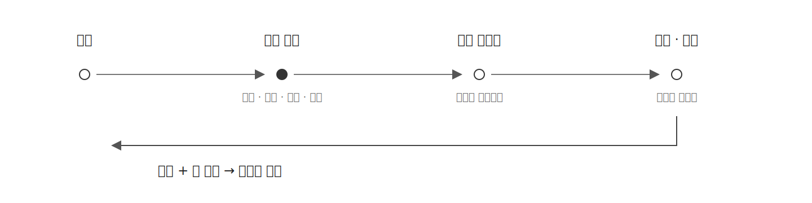
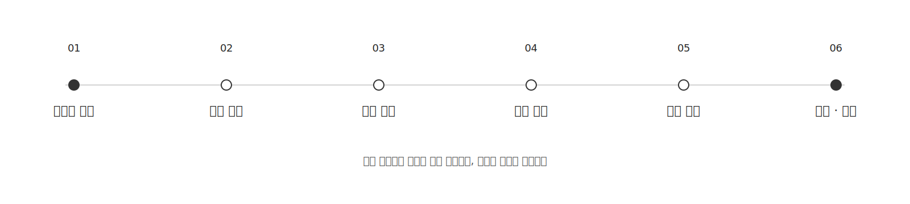

# 관리자 AI 어시스턴트 결정 이력 (Decision Log)

> 파이널 프로젝트에서 추가 담당한 관리자 AI 어시스턴트의 핵심 구조와 기술적 결정 사항을 기록하는 공간입니다.
> 각 결정의 배경과 판단 근거, 트레이드 오프를 함께 작성하여 당시의 사고 과정을 남기고, 향후 비효율적인 결정으로 판단될 경우 피드백을 통해 개발 사고를 확장하는 것을 목적으로 합니다.

---

## 2026-07-21

### 1. 관리·운영용 챗봇 추가

* **맥락 및 배경 (Context):** 현재 플랫폼에는 운영 현황을 확인할 모니터링 화면이 없고, 오늘 주문이 몇 건인지 확인하려 해도 DB를 직접 조회해야 하는 구조이다. OPENAT은 드롭 오픈 시점의 재고뿐만 아니라 주문 사가, 결제·환불, 정산까지 운영자가 함께 확인해야 하는데, 필요한 질문마다 관리 화면과 집계 기능을 하나씩 만드는 방식은 파이널 남은 기간과 기능 개발 효율 관점에서 맞지 않다고 생각했다. 그렇다면 복잡하고 많은 모니터링 기능을 모두 만들지 않고도 운영자가 필요한 정보를 확인할 수 있는 방법은 무엇일까?
* **결정 사항 (Decision):** 필요한 모니터링 기능을 전부 만드는 대신, 운영자 입장에서 개인화된 운영·관리 질문에 답하는 챗봇을 추가하기로 결정하였다. 정해진 지표만 보여주는 여러 화면보다 하나의 질문 창에서 원하는 기간과 기준을 자연어로 물어보고, 그 질문에 필요한 운영 정보만 조합하여 답을 얻는 방식이 기능 개발 효율과 실제 운영 편의 양쪽에서 더 효율적이라고 판단하였다.
* **트레이드 오프 (Trade-off):** 챗봇을 도입하면 질문마다 추론 비용과 응답 시간이 발생하며, 외부 추론 API만 사용하면 사용량이 그대로 고정 외부 비용과 모델 선택 제약으로 이어진다. 다만 장기적인 토큰 비용과 외부 예산에 따른 품질 제약을 줄이기 위해 로컬 추론 LLM 서버를 이미 도입하였고, 서비스는 OpenAI 호환 계약으로 연결할 수 있으므로 추가 비용을 최소화하면서 기능을 확장할 수 있다고 판단하였다.

---

## 2026-07-22

### 1. 관리자 챗봇 역할 설계

* **맥락 및 배경 (Context):** 관리·운영용 챗봇을 만들기로 결정했지만 단순 주문 집계만 제공할지, 플랫폼 운영 방법까지 답할지, 일반 질문도 허용할지 역할이 명확하지 않았다. 역할을 먼저 확정하지 않으면 필요한 데이터와 문서, 외부 도구 범위가 계속 늘어나고 답변 기준도 흔들릴 수 있으므로 챗봇이 무엇을 책임질지 정의가 필요하였다.
* **결정 사항 (Decision):** 관리자 챗봇은 **운영 데이터 현황**, **운영 질문**, **범용 편의성 질문**의 세 가지 역할을 담당하는 것으로 결정하였다.
  * 운영 데이터 현황은 주문·결제·환불·정산·회원·상품·드롭·재고·이벤트·사가의 현재 상태와 집계, 추이를 자연어로 확인하기 위한 역할이다.
  * 운영 질문은 OPENAT이 한정 수량 드롭 커머스라는 플랫폼 정보와 실제 주문·재고·결제·정산 흐름을 근거로, 관리자가 무엇을 확인하고 어떤 순서로 판단해야 하는지 안내하기 위한 역할이다. 현재 문서량에서는 복잡한 벡터 검색보다 질문과 관련된 운영 문서 영역을 선택해 압축된 컨텍스트로 제공하는 방식을 사용한다.
  * 범용 편의성 질문은 플랫폼 운영자도 하나의 챗봇을 자연스럽게 사용할 수 있도록 날씨, 최신 공개 정보와 일반적인 설명을 함께 제공하기 위한 역할이다.
* **트레이드 오프 (Trade-off):** 서로 성격이 다른 역할을 하나의 챗봇에 넣으면 질문 분류와 도구 선택 범위가 넓어지고, 잘못 분류할 경우 운영 질문에 일반 지식으로 답하거나 불필요한 도구를 호출할 수 있다. 그러나 각 역할을 별도 화면이나 별도 챗봇으로 나누면 사용자는 질문할 때마다 기능을 먼저 구분해야 한다. 하나의 자연어 진입점을 유지하되 각 역할의 데이터와 실행 경계를 분리하는 편이 관리자 사용성이라는 최초 목적에 더 맞다고 판단하였다.

### 2. 관리자 챗봇 구조 설계

* **맥락 및 배경 (Context):** 초기에는 자연어 질문을 쿼리 플랜으로 바로 바꾸는 구조를 생각했지만, 이 구조는 “저번 달 주문 수는?”, “어떤 상품이 많이 팔렸어?” 같은 간단한 표현도 정해진 규칙에서 벗어나면 처리할 수 없는 구조다. 이를 해결하기 위해 표현과 날짜 용어를 코드에서 계속 정규화하면 결국 자연어 처리 책임을 다시 애플리케이션이 맡게 되어 LLM을 도입한 이유가 사라진다고 생각했다. 반대로 모든 도메인의 상세 스키마를 한 번에 보내면 8K 컨텍스트와 응답 시간에 불리하고, LLM에 실제 쿼리 실행까지 맡기면 데이터 접근 범위를 통제할 수 없다. 자연어 해석은 LLM에 맡기면서도 실행 책임은 서버가 가져갈 구조가 필요하였다.
* **결정 사항 (Decision):** 질문의 자유도를 제한하는 대신 **실행 가능한 구조를 제한하는 방식**으로 바꾸고, 레벨별 역할과 전체 실행 순서가 정해진 트리 구조를 사용하기로 결정하였다. 첫 단계에서 사용자 질문에 필요한 영역 조합을 선택하고, 다음 단계에서는 선택된 영역의 스키마와 원 질문만 다시 보내 LLM이 실행 구조를 채운다. 채울 수 없는 독립 요청은 `FAIL`로 남기고 나머지 `SUCCESS` 요청은 계속 실행한다. 애플리케이션은 성공한 구조를 다시 검증한 뒤 미리 허용한 조회와 API만 실행하고, 조회 결과와 원 질문을 LLM에 보내 최종 자연어 답변을 만든다.

  트리 구조라고 해서 임의로 계속 재귀하거나 최대 깊이를 탐색하는 방식은 아니다. 각 레벨의 책임과 총 실행 흐름은 고정하고, 한 질문에서 여러 영역이 필요하면 같은 레벨에서 조합하는 방식으로 결정하였다.

  

* **트레이드 오프 (Trade-off):** 한 번의 LLM 요청으로 끝내는 방식보다 단계별 요청과 중간 결과 관리가 추가되어 응답 시간이 길어질 수 있다. 하지만 하나의 필드를 해석하지 못했다고 전체 질문을 실패시키는 구조보다 부분 성공을 유지할 수 있고, 필요한 스키마만 보내므로 제한된 컨텍스트를 효율적으로 사용할 수 있다. 자연어 질문의 자유도가 보안 권한의 확대로 이어지지 않도록 개인정보와 회원·구매자·판매자 식별정보, 쓰기 작업, 자유 SQL은 스키마에서 아예 제외하여 실행 자체가 되지 않도록 결정하였다.

### 3. 관리자 챗봇 구현 흐름 설계

* **맥락 및 배경 (Context):** 남은 가용 기간은 5일이며, 챗봇 구조는 일반 백엔드 기능과 달리 코드를 완성해도 실제 모델이 의도한 영역과 필드를 안정적으로 선택하지 못하면 전체 구현이 의미가 없다. 화면과 데이터 연동을 먼저 만든 뒤 실패율이나 응답 시간이 허용 범위를 벗어난다는 사실을 발견하면 회수 비용이 크므로, 가장 불확실한 추론 구조부터 실제 서버에서 확인할 필요가 있었다.
* **결정 사항 (Decision):** 코드 구현보다 실제 추론 서버 검증을 먼저 진행하고, 측정 결과를 기준으로 구조와 구현 범위를 확정하는 순서로 결정하였다.

  

* **트레이드 오프 (Trade-off):** 짧은 일정에서 시나리오 작성과 추론 서버 측정에 시간을 먼저 사용하므로 당장 보이는 기능 구현 시간은 줄어든다. 하지만 모델의 실패율과 응답 시간은 코드만 보고 판단할 수 없고, 이 부분이 전체 구조의 가장 큰 위험이므로 먼저 확인하는 편이 구현 후 구조를 되돌리는 비용보다 훨씬 작다고 판단하였다.

### 4. 챗봇 구현을 위한 데이터 책임 협의

* **맥락 및 배경 (Context):** OPENAT은 회원·상품·주문·결제·정산이 각자의 데이터를 소유하는 MSA이며, 다른 도메인의 DB를 직접 조회하지 않고 API 또는 이벤트로 접근하는 것이 기본 원칙이다. 그러나 챗봇이 주문 집계, 상품별 판매량, 정산 금액, 사가 정체처럼 여러 도메인의 운영 질문을 처리하려면 질문 조합만큼 조회 API를 새로 작성해야 하므로 남은 기간 내 구현 가능성이 불확실했다. 반대로 AI가 원본 테이블을 자유롭게 조회하게 하는 방식은 MSA 데이터 책임과 보안 경계를 모두 무너뜨리므로 사용할 수 없었다.
* **결정 사항 (Decision):** 현재 서비스들이 하나의 물리 PostgreSQL 안에서 스키마를 분리해 사용하는 구조라는 점을 이용해, 팀 협의를 전제로 **읽기 전용 뷰 스키마 방식**을 명시적인 예외로 사용하기로 결정하였다. 원천 도메인은 제공하는 데이터의 의미와 정합성, 변경 시 통지 책임을 가지고, AI는 승인된 뷰 안에서 조회를 조합하고 자연어 답변으로 만드는 책임을 가지는 두 단계 구조로 분리한다. AI 전용 계정에는 승인된 뷰의 조회 권한과 공개 주문번호 전용 함수의 실행 권한만 부여하고 원본 테이블 접근과 주 데이터소스 우회는 허용하지 않는다.

  데이터 범위도 이 단계에서 제한한다. 회원은 역할·가입 경로와 같은 비식별 집계만 제공하고 특정 회원 정보는 조회하지 않는다. 주문은 그룹 집계와 추이, 공개 주문번호를 통한 개별 상태·이력·사가를 허용한다. 상품과 드롭은 공개 식별자, 상품명·카테고리·가격·수량·상태 같은 비민감 운영 정보까지 개별 조회할 수 있지만 회원·구매자·판매자 식별정보는 제외한다.
* **트레이드 오프 (Trade-off):** 읽기 전용 뷰도 결국 다른 도메인의 DB를 직접 읽는 구조이므로 MSA 원칙에 대한 예외이며, 원천 스키마 변경의 영향을 받을 수 있다. 따라서 현재처럼 물리 DB를 공유하는 환경과 팀이 합의한 조회 범위에서만 사용한다. 향후 서비스별 DB가 물리적으로 분리되면 조회 어댑터를 API 조합이나 Kafka 이벤트 기반 전용 읽기 모델로 교체하고, 필요한 변경 이벤트를 확보하기 어려운 경우에는 [Debezium CDC](https://debezium.io/documentation/reference/stable/architecture.html)를 이용한 별도 조회 모델도 대안으로 검토하기로 하였다.
