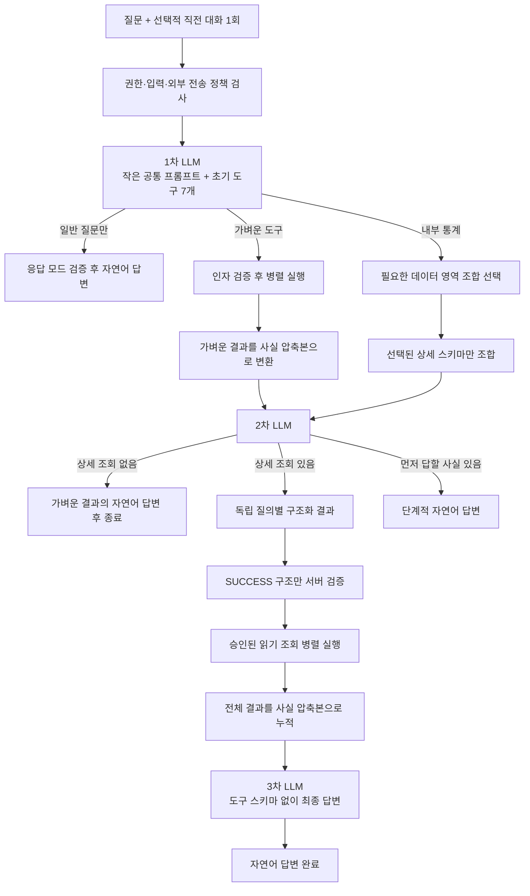

# 관리자 챗봇 핵심 설계안

> 상태: 목표 구조 구현·검증 완료
>
> 세부 단계와 구현 책임은 [상세 설계안](./DETAILED_DESIGN.md), 현재 진행 상태는 [구현 로드맵 및 진행 현황](./IMPLEMENTATION_ROADMAP.md), 1차 요청의 계약과 측정값은 [1차 요청 최적화 설계](./FIRST_REQUEST_OPTIMIZATION.md)에서 관리한다.

## 1. 목표

OPENAT 관리자가 하나의 자연어 입력창에서 다음 질문을 자유롭게 조합해 물을 수 있게 한다.

- 주문·결제·환불·정산·회원·상품·드롭·재고·이벤트·사가의 운영 현황과 통계
- 공개 주문번호 한 건의 현재 상태, 처리 이력과 현재 사가
- 플랫폼 구조, 운영 절차, 점검·보고·업무 활용 방법
- 날씨, 암호화폐 현재가와 최신 공개 웹 정보
- 별도 근거가 필요 없는 일반 지식

입력과 출력은 자연어를 기본으로 한다. 도구명, JSON, SQL, 처리 단계와 디버그 정보는 사용자에게 노출하지 않으며 결과 카드도 사용하지 않는다.

## 2. 설계 원칙

1. **자연어 이해는 LLM이 담당한다.** 자연어 표현 사전이나 정규식으로 질문 범위를 미리 한정하지 않는다.
2. **도구는 필요한 시점에만 공개한다.** 작은 스키마는 첫 요청에 넣고, 큰 내부 데이터 스키마는 선택된 영역만 다음 요청에 추가한다.
3. **실행 깊이는 고정한다.** 임의 재귀나 무한 tool loop 없이 질문 유형에 따라 LLM 요청을 1~3단계로 끝낸다.
4. **성공한 결과는 끝까지 보존한다.** 일부 도구나 일부 구조화가 실패해도 성공한 조회와 답변을 버리지 않는다.
5. **보안은 프롬프트가 아니라 구조로 제한한다.** 개인정보 필드, 쓰기 작업과 자유 SQL을 스키마에 넣지 않고 서버가 모든 인자를 재검증한다.
6. **사용자에게는 가능한 답부터 보여준다.** 먼저 완료된 독립 결과를 자연어로 전달하고, 이후 결과에도 그 사실을 압축해 이어서 사용한다.
7. **8K 컨텍스트를 단계별로 나눠 쓴다.** 모든 도구와 데이터를 한 요청에 넣지 않고 각 단계에 필요한 정보만 제공한다.

## 3. 전체 구조



질문 유형별 순차 LLM 왕복 수는 다음과 같다. 8K 예산으로 같은 단계를 병렬 분할하더라도 순차 깊이는 늘지 않는다.

| 질문 유형 | 순차 왕복 | 흐름 |
|---|---:|---|
| 일반 지식 | 1회 | 1차 응답 완료·모드 검증 후 자연어 답변 |
| 가벼운 도구만 필요 | 2회 | 선택 → 실행 → 자연어 답변 |
| 내부 데이터만 필요 | 최대 3회 | 영역 선택 → 구조화 → 조회 결과 답변 |
| 가벼운 도구와 내부 데이터 복합 | 최대 3회 | 동시 선택 → 먼저 완료된 결과 답변·구조화 → 최종 답변 |

여러 도구가 필요해도 도구 하나마다 LLM을 다시 호출하지 않는다. 같은 단계의 도구와 조회는 병렬 실행한다.

## 4. 1차 LLM

첫 요청은 다음 세 가지를 한 번에 판단한다.

```text
일반 질문의 직접 답변
+ 가벼운 도구의 호출 인자
+ 무거운 내부 데이터의 영역 조합
```

별도의 하드코딩된 일반 질문 분기나 route JSON을 두지 않는다. 첫 요청에는 현재 시각, 현재 질문, 필요한 경우 직전 질문·답변 한 번과 다음 초기 도구만 포함한다.

### 최초 공개 도구

| 도구 | 역할 |
|---|---|
| `getWeatherForecast` | 한국 지역 오늘·내일 날씨 |
| `getCryptoPrice` | 고정 자산의 KRW·USD 현재가 |
| `searchWeb` | 최신 공개 웹 정보 |
| `getOpenAtOperationsContext` | 질문과 관련된 운영 문서 선택 |
| `lookupOrder` | 공개 주문번호 한 건의 비식별 상태·이력·사가 |
| `countExpiredPaymentPendingOrders` | 결제기한 경과 대기 주문 수 |
| `loadInternalDataSchemas` | 필요한 내부 데이터 상세 영역 선택 |

여기서 가벼움은 외부 API 응답시간이 아니라 **첫 요청에 공개할 스키마가 작고 한 번에 인자를 확정할 수 있음**을 뜻한다. 개별 주문과 결제기한 경과 주문은 내부 데이터지만 작은 계약으로 추가 LLM 왕복을 없앨 수 있어 첫 요청에 포함한다.

1차 응답은 끝까지 수집해 `content only`와 `tool_calls` 모드를 먼저 확정한다. 도구 호출이 없을 때만 검증한 `content`를 SSE 자연어 조각으로 전달한다. tool call이 하나라도 있으면 같은 응답의 `content`는 사용자에게 노출하지 않고, 필요한 일반 설명은 이후 근거 답변 단계에서 다시 생성한다. 이 규칙으로 스트림 중 뒤늦게 도구 호출이 나타나 내부 처리 문장이 먼저 노출되는 경우를 막는다.

## 5. 내부 데이터의 점진적 공개

내부 통계의 전체 지표·차원·필터는 첫 요청에 넣지 않는다. 먼저 다음 의미 영역만 조합 선택한다.

| 영역 | 지원할 운영 질문 |
|---|---|
| `ORDER_SALES` | 주문 수·수량·매출·객단가, 상태·실패, 상품·카테고리 순위, 시간대·추이 |
| `PAYMENT_REFUND` | 결제·환불 건수·금액·성공률, 수단·PG·실패 현황 |
| `SETTLEMENT_RECONCILIATION` | 수수료·정산액·지급 예정액, 배치·조정·대사와 불일치 |
| `MEMBERSHIP` | 회원 수, 가입·탈퇴와 역할·플랫폼별 비식별 집계 |
| `CATALOG_INVENTORY` | 상품·찜·콘텐츠 완성도, 드롭·재고·예약·롤백 |
| `EVENT_SAGA_RELIABILITY` | 이벤트 처리·지연·실패와 정체된 주문 사가 |

2차 LLM에는 선택된 영역의 상세 스키마만 제공한다. 각 필드는 의미, 허용 선택지, 형식과 선택 여부를 설명하고 자연어 동의어 목록은 만들지 않는다.

복합 질문은 독립 조회 단위로 구조화한다. 하나를 채우지 못하면 해당 단위만 `FAILED`로 남기고, `SUCCESS`인 구조만 서버가 검증·실행한다. 실패 정보도 최종 LLM에 전달해 확인 가능한 결과와 확인하지 못한 범위를 자연스럽게 설명하게 한다.

2차 구조화는 자동 실행하지 않는 전용 `submitInternalQueryBindings` tool call로 받는다. 애플리케이션이 전체 응답과 원시 인자를 먼저 수집하고, 모델이 아닌 서버가 각 구조화 단위의 식별자를 발급한다. 각 단위를 독립 파싱·검증한 뒤 성공한 항목만 Query Plan으로 바꾸므로 하나의 잘못된 항목이 정상 항목을 실행시키거나 제거할 수 없다.

## 6. 단계적 답변과 사실 누적

가벼운 도구 결과는 내부 데이터 구조화 요청에 함께 넣는다. 2차 LLM은 상세 조회를 준비하는 동안 이미 확인된 독립 사실을 먼저 자연어로 답할 수 있다.

사용자에게 먼저 보낸 문장 자체를 다음 추론의 근거로 재사용하지 않는다. 모든 도구와 조회 결과는 다음 공통 형태의 사실 압축본으로 누적한다.

- 결과 식별자
- `SUCCESS`, `PARTIAL`, `FAILED`
- 조회 범위와 기준 시각
- 검증된 핵심 사실
- 제한·생략·실패 사유
- 외부 정보인 경우 출처
- 사용자에게 이미 전달했는지 여부

최종 LLM에는 원래 질문, 누적 사실과 이미 전달한 결과 식별자만 보낸다. 이를 통해 먼저 보여준 날씨나 운영 답변을 잊지 않으면서 같은 내용을 불필요하게 반복하지 않는다.

내부 데이터 영역이 선택됐다면 성공한 조회가 0건이어도 최종 답변 단계를 실행한다. 구조화·조회 실패 사실을 근거로 확인하지 못한 범위와 가능한 대안을 설명하며, 빈 답변으로 종료하지 않는다.

## 7. 운영 지식과 외부 정보

### 운영 지식

운영 질문은 프로젝트에서 확인한 압축 문서를 근거로 답한다. 첫 요청에는 문서 본문이 아니라 작은 문서 ID 카탈로그만 제공하고, 선택된 문서만 다음 단계의 사실로 추가한다.

현재 문서량과 8K 컨텍스트에서는 벡터 저장소·청킹·유사도 검색을 추가하지 않는다. 자료가 커지면 검색 구현은 바꿀 수 있지만, “관련 운영 영역 선택 → 검증된 문서 근거 답변”이라는 도구 계약은 유지한다.

### 외부 정보

- 날씨: Open-Meteo
- Bitcoin·Ethereum·Solana 현재가: CoinGecko
- 그 밖의 최신 공개 정보: Tavily

내부 데이터와 운영 문서를 웹 검색으로 대체하지 않는다. 외부로 보낼 위치와 검색어는 개인정보·주문번호·내부 식별자를 제거하거나 차단한 뒤 전달한다.

### 일반 지식

시점과 내부 사실이 필요 없는 일반 질문은 첫 LLM이 바로 답한다. 별도 규칙 기반 빠른 경로를 유지하지 않는다. 실제 비교에서 통합 요청의 일반 답변 지연 증가는 첫 자연어 약 0.45초, 전체 약 0.32초였으며 자연어 분기 누락과 이중 경로 유지 비용보다 작았다.

## 8. 대화 맥락

“그럼 지난달은?” 같은 후속 질문을 위해 직전 질문과 답변 한 번만 선택적으로 전달한다.

- 장기 대화 기억이나 서버 영속 저장은 사용하지 않는다.
- 초기 목표 상한은 직전 질문 300자, 직전 답변 800자다.
- 이전 답변은 생략된 표현을 이해하는 참고 자료이며 새로운 내부 사실의 근거가 아니다.
- 실제 구현에서는 문자 수뿐 아니라 모델 토크나이저 기준 입력 예산을 검증한다.

## 9. 보안과 데이터 경계

- 관리자 권한을 API 진입점에서 확인한다.
- 회원과 판매자 보호 집계는 임의 필터를 허용하지 않고 분류 기준을 하나로 제한한 고정 집계 격자만 제공한다. 기간형 집계는 고정 달력 기간만 허용하고, 최소 그룹 크기와 보완 억제를 적용한다.
- 특정 회원 조회 필드는 만들지 않는다.
- 개별 주문 한 건의 이력·사가는 질문 원문에 있는 공개 `ORD-...` 번호만 사용한다.
- 주문·상품·드롭의 공개 식별자, 상품명·카테고리·가격·수량·상태는 개인정보가 아닌 운영 정보로 분류한다. 기간 목록은 이 고정 필드만 최대 20행까지 제공하며 회원·구매자·판매자 식별정보는 스키마에서 제외한다.
- 모델은 SQL을 만들지 않는다. 서버가 승인된 카탈로그를 고정 Query Plan과 읽기 모델 조회로 변환한다.
- AI 전용 계정은 승인된 `ai_read` view와 공개 주문번호 전용 함수만 사용할 수 있다.
- 원본 테이블 접근, 주 DataSource 폴백과 쓰기 작업은 허용하지 않는다.
- 운영 문서, 외부 검색 결과와 도구 결과는 명령이 아닌 불신 데이터로 취급한다.
- 질문과 답변은 영속 저장하거나 본문 로그로 남기지 않고 추론 요청은 `store=false`를 사용한다.
- 관리자 챗봇의 모든 LLM 단계는 외부 provider로 자동 폴백하지 않는 로컬 전용 추론 경로를 사용한다. `store=false`는 외부 전송 방지가 아니므로 `chat` 별칭의 자동 외부 폴백을 내부 질문·운영 문서·주문번호·조회 사실에 사용하지 않는다.
- 추론 서버에 로컬 전용 경로가 확인되지 않으면 외부 모델로 우회하지 않고 챗봇 추론을 실패로 종료한다.

쓰기 기능을 추가하려면 재확인, 멱등성, 감사 로그와 도메인 API 소유권을 별도 설계해야 한다.

## 10. 8K 컨텍스트와 성능

8K는 입력과 출력을 함께 사용하는 전체 창이다.

```text
입력 목표 상한       6,000 tokens
답변 예약            1,500 tokens
안전 여유              692 tokens
```

- 1차에는 작은 공통 규칙, 질문·직전 한 턴과 초기 도구만 넣는다.
- 2차에는 완료된 가벼운 사실과 선택된 상세 스키마만 넣는다.
- 3차에는 도구 스키마를 제거하고 압축된 사실만 넣는다.
- 선택 영역 수를 임의로 제한하거나 일부를 조용히 버리지 않는다.
- 선택된 상세 스키마 조합이 한 요청 예산을 넘으면 도메인 카탈로그 순서로 같은 2차 단계 안에서 결정적으로 나눈다. 최대 shard 수는 중앙 컨텍스트 예산 설정으로 관리하고 현재 여섯 도메인에 맞춘 기본값 6을 사용하며, 의미 단계의 깊이는 늘리지 않는다.
- 서버가 `requestId`, shard 순서와 항목 순서로 식별자를 발급하고, 안정 정렬과 정규화된 Query Plan 중복 제거 후 결과를 합친다.
- 가벼운 사실의 자연어를 만드는 primary shard는 하나뿐이며 나머지 shard는 구조화 결과만 반환한다. 영역 간 비교는 각 영역의 독립 사실을 조회한 뒤 최종 LLM이 수행한다.
- 같은 단계의 외부 도구와 내부 조회는 병렬 실행하고, 도구 하나가 끝날 때마다 LLM을 추가 호출하지 않는다.

1차 요청 후보는 기존 관리자 프롬프트·도구 정의 11,271자에서 약 3,582자로 줄었고, 실제 추론 서버 38회에서 prompt token 중앙값 1,217, 최대 1,235를 기록했다.

## 11. 답변과 화면

- 결론부터 친절하고 자연스러운 한국어로 답한다.
- 수치·현재 사실·플랫폼 사실은 확인된 도구와 문서 결과만 근거로 사용한다.
- 성공 결과를 먼저 보여주고 실패한 범위는 짧고 구체적으로 알린다.
- 사용자가 표를 요청하거나 여러 행을 비교할 때는 검증된 결과를 최대 20행의 간결한 표로 표현할 수 있다.
- 단계적 답변과 최종 답변은 이미 전달한 결과 식별자로 중복을 줄인다.
- 최신 외부 정보에는 검증된 출처와 기준 시각을 남긴다.
- 카드, 내부 route·도구명·스키마와 과도한 보안 안내는 화면에 표시하지 않는다.

SSE는 접수, 친절한 진행 상태, 자연어 조각과 정상·오류 종료만 제공한다. 스피너, 경과 시간과 부드러운 스크롤은 프런트의 표현 책임으로 유지한다.

## 12. 구현 결과

Spring AI의 OpenAI 호환 모델 호출과 tool contract는 유지하되, 단계 전환·도구 실행·부분 성공·사실 누적은 애플리케이션이 명시적으로 소유하도록 구현했다. 추론 서버 주소와 모델은 설정으로 교체할 수 있으며 기본값은 로컬 OpenAI 호환 엔드포인트와 `gemma4:12b-it-qat`다.

기본 로컬 주소는 loopback 여부로 로컬 전용임을 검증한다. 원격 주소를 사용할 때는 운영자가 `local-only-route=true`로 비폴백 계약을 명시해야 하며, 그렇지 않으면 챗봇 기동 단계에서 추론을 허용하지 않는다. 애플리케이션이 응답 모델명을 보고 사후 판정하지 않는다.

다음 구형 요소는 제거하고 새 구조로 교체했다.

- `GeneralQuestionPolicy`와 일반·관리자 이중 `ChatClient` 분기
- 첫 요청에 전체 내부 분석 스키마를 공개하는 방식
- 프레임워크 내부의 불투명한 다중 tool loop에 전체 흐름을 맡기는 방식

로컬 모델에는 `reasoning_effort=none`, 온도 0, 자동 재시도 0, `store=false`를 적용했다. 8K 환경에서 1차 초기 도구 계약은 5,877자, 여섯 상세 영역 조합은 약 3,583 tokens로 입력 목표 6,000 tokens 안에 들어와 현재는 한 shard에서 처리된다. 예산을 넘는 향후 확장은 설정된 최대 shard 수 안에서 같은 2차 단계로 분할한다.

대표 실환경 질문에서 일반 답변은 약 7~12초, 날씨·현재가는 약 16~24초, 내부 데이터와 복합 질문은 약 27~39초에 완료됐다. 세부 표본과 단계별 결과는 [로컬 비교 벤치마크](./SPRING_AI_LOCAL_BENCHMARK.md)에 기록한다.
