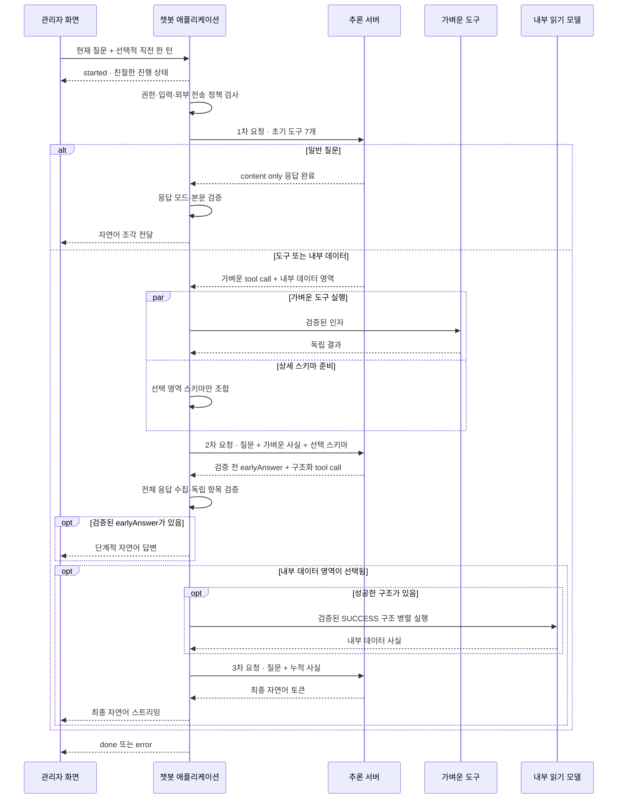

# 관리자 챗봇 상세 설계안

> 상태: 목표 구조 구현·검증 완료
>
> 이 문서는 [핵심 설계안](./DESIGN.md)의 구현 계약과 실제 책임 경계를 설명한다. 상세 카탈로그는 코드의 닫힌 카탈로그를 단일 기준으로 사용한다.
>
> 이 문서의 0~4단계는 요청 한 건의 **런타임 처리 단계**다. [구현 로드맵](./IMPLEMENTATION_ROADMAP.md)의 작업 단계와는 구분한다.

## 1. 범위와 완료 기준

관리자 챗봇은 일반 지식, 운영 문서, 외부 정보와 승인된 내부 데이터를 자연어 질문 하나에서 조합한다. 최종 화면은 자연어 대화만 보여주며 내부 구조는 노출하지 않는다.

범위에 포함한다.

- 일반 질문의 직접 답변
- 운영 문서를 근거로 한 플랫폼·관리 방법 안내
- 날씨, 암호화폐 현재가와 최신 웹 정보
- 주문·결제·환불·정산·회원·상품·드롭·재고·이벤트·사가 통계
- 공개 주문번호 한 건의 비식별 상태·이력·현재 사가
- 복합 질문, 직전 한 턴 참조, 부분 성공과 단계적 답변

범위에서 제외한다.

- 특정 회원 조회와 개인정보
- 자유 SQL과 원본 테이블 접근
- 주문·회원·상품·드롭 등 상태 변경
- 장기 대화 기억과 대화 영속 저장
- 카드 기반 응답과 내부 처리 정보 표시

구현 완료는 단순히 LLM이 답변을 생성하는 상태가 아니다. 선택 정확도, 서버 검증, 데이터 권한, 부분 실패, 8K 예산, SSE 종료와 실제 응답시간까지 함께 통과해야 한다.

## 2. 용어

| 용어 | 의미 |
|---|---|
| 1차 LLM | 일반 답변, 가벼운 도구와 내부 데이터 영역을 한 번에 선택하는 요청 |
| 가벼운 도구 | 첫 요청에 넣을 인자 스키마가 작고 즉시 실행 가능한 도구 |
| 상세 스키마 | 내부 통계의 지표·차원·필터·기간을 채우는 영역별 계약 |
| 구조화 결과 | 상세 스키마를 질문에 맞게 채운 독립 조회 단위 |
| 사실 압축본 | 도구·DB 원문에서 최종 답변에 필요한 검증 사실만 남긴 공통 결과 |
| 단계적 답변 | 먼저 완료된 독립 사실을 최종 조회 전 자연어로 전달하는 답변 |
| 단계 | 의미상 처리 레벨. 8K 예산으로 같은 레벨을 병렬 분할해도 깊이는 늘지 않음 |

## 3. 단계별 처리 흐름



## 4. 0단계 — 요청 준비

애플리케이션이 LLM 호출 전에 다음 책임을 가진다.

- Gateway가 전달한 관리자 권한 확인
- 질문 길이·제어문자·명백한 보안 위반 검사
- request ID와 `Asia/Seoul` 기준 시각 생성
- 선택적 직전 질문·답변 한 번의 길이와 토큰 예산 검사
- 외부 전송 가능한 정보와 내부에만 남겨야 할 정보 구분
- 추론 서버와 필요한 도구의 가용성 확인
- 외부 provider 자동 폴백이 없는 로컬 전용 추론 경로 확인

직전 대화는 별도 저장소에서 불러오지 않는다. 클라이언트가 현재 질문과 함께 전달한 직전 한 턴만 사용하고, 초기 목표 상한은 질문 300자·답변 800자로 둔다. 이전 답변은 언어 맥락일 뿐 데이터 근거가 아니다.

관리자 챗봇은 일반 질문을 포함한 모든 LLM 단계에 로컬 전용 추론 경로를 사용한다. 현재 `chat` 별칭처럼 로컬 장애 시 외부 모델로 자동 우회하는 경로는 사용하지 않는다. 로컬 전용 계약이 확인되지 않으면 외부로 우회하지 않고 추론 불가로 종료한다.

## 5. 1단계 — 통합 1차 LLM

### 5.1 입력

- 현재 KST
- 현재 질문
- 필요한 경우 직전 질문·답변 한 번
- 일반 답변·도구 선택·보안·본문 노출 규칙
- 가벼운 실제 도구 6개
- 상세 데이터 영역 선택 도구 1개

최초 공개 도구:

```text
getWeatherForecast
getCryptoPrice
searchWeb
getOpenAtOperationsContext
lookupOrder
countExpiredPaymentPendingOrders
loadInternalDataSchemas
```

### 5.2 출력

표준 OpenAI 호환 `content`와 `tool_calls`를 사용한다.

- 일반 질문이면 `content`로 답한다.
- 도구가 필요한 사실은 추측하지 않고 tool call로 반환한다.
- 복합 질문이면 여러 가벼운 도구와 내부 데이터 영역을 함께 선택한다.
- tool call과 함께 오는 `content`는 사용자에게 노출하지 않는다.
- 내부 통계는 상세 필드가 아니라 필요한 여섯 영역만 조합한다.

서버는 도구명, JSON 형식, 닫힌 카탈로그, 주문번호와 외부 전송 정책을 검증한다. 알 수 없는 도구나 잘못된 인자는 실행하지 않되 같은 응답의 다른 정상 호출은 보존한다.

1차 upstream 응답은 완료까지 버퍼링한다. tool call이 없고 `content`만 있는 경우에만 일반 답변으로 확정해 SSE 조각으로 전달한다. tool call이 하나라도 있으면 같은 응답의 `content`를 폐기하고 도구·영역만 처리한다. 사용자 체감 첫 답변 시간은 upstream 첫 토큰이 아니라 검증 뒤 첫 SSE 조각을 기준으로 측정한다.

### 5.3 완료된 검증

1단계의 상세 계약과 전체 표본은 [1차 요청 최적화 설계](./FIRST_REQUEST_OPTIMIZATION.md)에 기록한다.

| 항목 | 결과 |
|---|---:|
| 직접 요청 | 19개 시나리오 × 2회 = 38회 |
| 기대한 직접 답변 또는 도구·영역 선택 | 38/38 |
| 도구 포함 요청 중앙값 | 5.676초 |
| 도구 포함 요청 p95 | 8.922초 |
| 일반 답변 중앙값 | 7.653초 |
| prompt token 중앙값 / 최대 | 1,217 / 1,235 |

일반 전용 경로보다 통합 요청은 첫 자연어 중앙값이 약 0.45초, 전체가 약 0.32초 느렸다. 이 비용보다 하드코딩 분기 누락과 이중 경로 유지 비용이 크므로 통합 요청으로 확정했다.

## 6. 2단계 — 가벼운 실행과 상세 구조화

2단계는 1차 결과를 실행 가능한 사실과 내부 조회 구조로 바꾼다.

### 6.1 가벼운 도구 실행

- 1차 LLM이 선택한 도구를 서버 검증 후 병렬 실행한다.
- 도구별 성공·부분 성공·실패를 서로 독립적으로 보존한다.
- 외부 API 원문과 운영 문서 전체를 그대로 넘기지 않고 사실 압축본으로 바꾼다.
- 상세 내부 조회가 함께 있으면 완료된 가벼운 사실을 2차 LLM 입력에 먼저 포함한다.
- 가벼운 도구만 있는 질문은 2차 LLM의 자연어 답변으로 종료한다.

### 6.2 선택된 상세 스키마 조합

`loadInternalDataSchemas`가 고른 영역만 스키마 레지스트리에서 가져온다.

- 선택되지 않은 영역의 지표와 필드는 넣지 않는다.
- 공통 기간·정렬·행 수 계약은 중복 정의하지 않고 재사용한다.
- 각 필드는 의미, 필수 여부, 허용 카탈로그, 형식과 제약을 가진다.
- 자연어 동의어와 질문 예문을 하드코딩한 표현 사전은 만들지 않는다.
- 선택 영역 수를 임의로 제한하지 않는다.

조합한 입력이 토큰 예산을 넘으면 선택 영역을 버리지 않고 도메인 카탈로그 순서로 같은 2단계 안에서 결정적으로 분할한다. 최대 shard 수는 컨텍스트 예산 설정 `chat.inference.context.max-schema-shards`로 분리하고, 현재 여섯 도메인에 맞춘 기본값 6을 사용하되 실제 도메인 수를 넘지 않게 검증한다.

### 6.3 2차 wire 계약

2차 요청은 자동 tool 실행을 끈 단계 전용 호출로 수행한다. 각 shard는 정확히 하나의 `submitInternalQueryBindings` tool call을 반환하고, 애플리케이션이 전체 assistant 응답과 원시 arguments를 받은 뒤에만 처리한다.

논리 인자는 다음 두 부분으로 구성한다.

```text
earlyAnswer
bindings[]
```

- `earlyAnswer`: 완료된 가벼운 사실을 사용자에게 먼저 설명하는 자연어. primary shard 하나만 생성하며 다른 shard에서는 비운다.
- `bindings[]`: 사용자가 요구한 독립 조회 단위 목록.

각 binding은 다음 의미를 가진다.

```text
domain
status: SUCCESS | FAILED
queryPlan: SUCCESS일 때만 존재
failureReason: FAILED일 때만 존재
```

모델은 `bindingId`를 만들지 않는다. 서버가 `requestId`, shard 순서와 binding 순서로 식별자를 발급한다. arguments 전체를 JSON tree로 읽은 뒤 binding을 하나씩 독립 변환·검증한다. 한 binding의 enum·필드·조합이 잘못돼도 형식이 정상인 다른 binding은 보존한다.

전체 arguments가 JSON으로 파싱되지 않을 때만 같은 shard에서 한 번 형식 복구를 요청한다. 다시 실패하면 해당 shard를 `FAILED`로 합성하고 다른 shard는 유지한다. Spring AI가 tool call을 먼저 실행하거나 `.content()`만 반환해 구조를 숨기는 경로는 사용하지 않는다.

분할 결과는 서버 발급 식별자 순서로 안정 정렬하고 정규화된 Query Plan이 같은 항목은 한 번만 실행한다. 영역 간 비교는 shard 안에서 조인하지 않고 각 영역의 독립 사실을 최종 LLM에서 비교한다.

하나의 필드나 영역을 채우지 못했다고 전체 복합 질문을 실패시키지 않는다. 서버는 `SUCCESS` 구조만 실행하고 `FAILED`는 최종 답변 근거에 남긴다.

2차 단계 구현과 실제 추론 서버 검증에서 다음을 확인했다.

- 여섯 영역은 데이터셋별 `metricValues`, `metricMeanings`, 차원·필터·시간 필드 카탈로그를 분리해 모델이 설명 문자열을 enum 값으로 오인하지 않게 했다.
- 전체 여섯 영역을 조합해도 약 3,583 tokens로 입력 목표 6,000 tokens 안에 들어 현재는 한 shard에서 처리된다.
- 질문의 자연어 표현은 카탈로그 설명과 의미적으로 대응시키고, 같은 데이터셋·기간·차원·필터의 여러 지표는 한 binding으로 합친다.
- 한 binding의 미지원 필드와 형식 오류는 해당 항목만 `FAILED`로 보존하며 다른 `SUCCESS` 항목은 실행한다.
- 전체 arguments가 깨진 경우에만 같은 shard에서 형식 복구를 한 번 수행한다.

## 7. 상세 내부 데이터 영역

상세 스키마는 현재 구현된 분석 카탈로그와 읽기 모델을 기반으로 다음 영역 팩으로 재구성한다.

| 영역 | 주요 데이터 |
|---|---|
| `ORDER_SALES` | 주문, 판매 수량·금액·객단가, 상태·실패·완료시간, 상품·카테고리·시간대 |
| `PAYMENT_REFUND` | 결제 시도·승인·실패·순결제액, 환불 요청·완료·금액 |
| `SETTLEMENT_RECONCILIATION` | 주문·판매자 정산, 배치·조정, 대사 결과와 불일치 |
| `MEMBERSHIP` | 현재 회원, 신규 가입·탈퇴, 역할·가입 플랫폼별 비식별 집계 |
| `CATALOG_INVENTORY` | 상품·찜·콘텐츠 완성도, 드롭·초기/잔여 재고·차감·롤백 |
| `EVENT_SAGA_RELIABILITY` | 이벤트 처리·대기·실패·최장 지연, 사가 수·정체 |

지원 지표를 모든 조합에 허용하지 않는다. 각 영역은 데이터셋별로 가능한 지표, 차원, 시간 필드와 필터의 교차 조합을 닫힌 카탈로그로 제공하고 서버가 다시 검증한다.

기간은 다음 원칙을 유지한다.

- 일반 상대 기간은 카탈로그로 받고 서버가 KST 경계를 계산한다.
- 명시 범위는 `yyyy-MM-dd HH:mm:ss` 형식의 시작 포함·종료 미포함으로 정규화한다.
- 실제 Query Plan에는 계산이 끝난 `startInclusive`, `endExclusive`만 전달한다.
- 기간은 최대 366일이며 추이 단위가 없으면 서버 정책이 기간 길이에 맞게 결정한다.

회원 집계와 판매자 정산은 다음 고정 공개 격자로 제한한다.

- `MEMBER_CURRENT`, `MEMBER_REGISTRATION`, `SELLER_SETTLEMENT`에는 임의 필터를 허용하지 않는다.
- 한 요청의 분류 기준은 최대 하나다.
- 기간형 보호 집계는 `TODAY`, `YESTERDAY`, `THIS_WEEK`, `LAST_WEEK`, `THIS_MONTH`, `LAST_MONTH`만 허용한다. 임의 범위와 이동 기간은 거부한다.
- 공개되는 각 기간·분류 버킷은 서로 다른 주체 수가 k=5 이상이어야 한다.
- 한 행만 억제되어 전체값과 나머지 행의 차감으로 값이 드러나지 않도록 보완 억제를 적용한다.

비민감 리소스의 개별 행은 별도 공개 기준을 적용한다.

- 주문은 공개 주문번호와 상품명, 수량, 주문 당시 단가·총액, 상태·시각만 허용한다.
- 상품은 공개 상품 ID와 상품명·카테고리·현재 정상가·상태만 허용한다.
- 드롭은 공개 드롭 ID와 상품명·카테고리·판매가·재고·상태·일정만 허용한다.
- 개별 값 지표는 대응하는 공개 식별자 차원이 있을 때만 실행하며 결과는 최대 20행으로 제한한다.
- 지표와 공개 식별자의 의존성은 `metricRequirements` 카탈로그로 모델에 제공하고, 모델이 필수 차원을 빠뜨리면 서버가 같은 카탈로그로 보완한 뒤 다시 검증한다.
- 시간 필드는 사건별 의미를 카탈로그에 함께 제공한다. 별도 사건을 지정하지 않은 기간 내 주문은 생성 시각을 사용하고, 결제·완료·취소·환불 기간은 해당 사건 시각을 사용한다.
- 회원·구매자·판매자 식별정보, 배송·연락처, 결제 키와 자유 원문은 어떤 행 조회에도 넣지 않는다.

결과 행 수, 지표·차원·필터 수와 문자열 길이는 서버 상한으로 제한한다.

민감 집계의 최소 그룹 크기는 화면에 나온 행을 사후 제거하는 것으로 끝내지 않는다. 안전한 읽기 계층에서 제한과 정렬 전에 억제하고, 서버 카탈로그가 필터·분류·기간 조합을 다시 검증한다. 이 방식은 현재 무저장 요구에 맞춘 고정 공개 격자이며 형식적 차등 개인정보 보호는 아니다. 더 자유로운 교차 필터나 이동 기간이 필요해지면 질의 이력 기반 privacy budget 또는 차등 개인정보 보호를 별도 설계한다.

## 8. 3단계 — 내부 조회 실행

구조화 결과는 바로 SQL로 변환하지 않는다.

1. 스키마 형식과 카탈로그 검증
2. 데이터셋별 허용 조합 검증
3. 기간·행 수·최소 그룹 크기와 공개 주문번호 검증
4. 고정 Query Plan 생성
5. 승인된 읽기 모델에서 병렬 조회
6. 행·열·문자 수를 제한한 사실 압축본 생성

현재 구현에서 결정된 데이터 경계를 유지한다.

- AI 전용 `ai_read` view와 공개 주문번호 전용 함수
- 전용 계정 `ai_query_app`
- 원본 schema·table 권한 회수
- 읽기 전용 연결과 `REPEATABLE_READ`
- 쿼리 timeout 3초
- 주 DataSource 폴백 금지
- 기동 검증 실패 시 내부 데이터 기능만 비활성화

로컬과 배포의 구성 책임은 분리한다.

- `local` 프로필은 조회 설정이 완성된 경우 기존 개발용 주 DB 자격증명으로 정확한 계약을 먼저
  검증하고, 누락되었을 때만 동일 DDL을 한 트랜잭션으로 적용한다. 원본 도메인 테이블이 아직
  생성되지 않았으면 서버 기동을 막지 않고 고정 간격으로 재시도한다.
- 배포에서는 애플리케이션이 관리자 DDL을 실행하지 않는다. DDL·적용·검증 산출물과 조회 Secret
  revision을 결합한 identity가 달라질 때만 새 Kubernetes Job을 wave 9에서 실행한다. 동일
  identity의 완료 Job은 다음 전체 배포에서 재실행하지 않고, AI Deployment는 wave 10에서 진행한다.
- 배포 Job도 현재 비밀번호와 정확한 계약이 이미 유효하면 관리자 DDL을 건너뛰고 검증 결과만 남긴다.

서비스별 DB가 물리적으로 분리되면 API 조합, 이벤트 기반 읽기 모델 또는 CDC 투영으로 어댑터를 바꾼다. LLM에 공개하는 조회 계약과 보안 경계는 유지한다.

현재 같은 물리 DB의 `ai_read`는 MSA 데이터 소유권의 예외 후보다. 실제 운영 사용 전에는 관련 도메인 담당자와 view 의미, 변경 통지, 배포 순서와 장애 책임을 합의해야 한다.

## 9. 결과 누적과 부분 성공

모든 가벼운 도구, 구조화 실패와 내부 조회 결과는 공통 사실 압축본으로 변환한다.

| 필드 | 의미 |
|---|---|
| `segmentId` | 중복 방지와 전달 상태 추적용 식별자 |
| `status` | `SUCCESS`, `PARTIAL`, `FAILED` |
| `scope` | 기간·지역·데이터 범위 |
| `facts` | 답변에 필요한 검증된 핵심 사실 |
| `limitations` | 생략·절단·실패 이유 |
| `source` | 외부 출처 또는 내부 읽기 모델 |
| `observedAt` | 사실 기준 시각 |
| `deliveredToUser` | 단계적 답변으로 이미 전달했는지 여부 |

원시 DB 행, 외부 API 원문과 긴 운영 문서는 최종 LLM에 보내지 않는다. 최종 답변은 성공 사실을 먼저 설명하고, 실패한 범위는 그 이유가 확인된 경우에만 짧게 안내한다. 실패값을 추측하거나 다른 데이터로 대체하지 않는다.

## 10. 4단계 — 단계적·최종 자연어 답변

### 가벼운 도구만 있는 질문

2차 LLM이 원래 질문과 가벼운 사실을 받아 자연어로 답하고 종료한다.

### 내부 데이터만 있는 질문

2차 LLM은 구조화 결과를 만들고, 조회 완료 뒤 3차 LLM이 자연어 답변을 생성한다.

### 복합 질문

2차 LLM은 이미 완료된 가벼운 사실을 먼저 답하면서 내부 조회 구조를 만든다. 3차 LLM은 원래 질문, 전체 사실 압축본과 이미 전달한 `segmentId`를 받아 남은 답변을 이어간다.

최종 요청에는 도구 스키마를 넣지 않는다. 사용자가 이미 받은 내용을 그대로 반복하지 않고, 이후 데이터가 앞선 결과의 의미를 바꾸는 경우에만 관계를 분명하게 설명한다.

내부 데이터 영역이 선택됐다면 `SUCCESS` binding이 하나도 없어도 3차 LLM을 호출한다. 누적된 구조화 실패를 근거로 확인하지 못한 부분과 지원 가능한 대안을 답하고 종료한다. 3차 추론 자체를 사용할 수 없으면 서버가 검증된 고정 안내문으로 종료하되 빈 답변은 허용하지 않는다.

## 11. 운영 문서와 외부 도구

### 운영 문서

운영 컨텍스트 ID는 다음 기존 카탈로그를 유지한다.

```text
PLATFORM
ORDER_PAYMENT
CATALOG_INVENTORY
MEMBER_ACCESS
SETTLEMENT
RELIABILITY
REPORTING
OFFICE_PRODUCTIVITY
```

첫 LLM은 ID만 고르고 서버가 관련 문서를 조합한다. 문서 한 개 2,000자, 요청 합계 3,000자의 방어선을 적용하며, 초과 문서는 성공 문서를 버리지 않고 부분 성공으로 남긴다.

### 날씨

- 한국 행정구역의 오늘·내일만 지원한다.
- 1차 LLM이 지역명을 시·도와 시·군·구 수준으로 정규화하고 근사한 WGS84 대표 위도·경도를 함께 채운다.
- 같은 이름의 지역을 시·도로 구분할 수 없으면 도구를 호출하지 않고 사용자에게 지역을 확인한다.
- 서버는 지역명에서 도로명·건물번호와 민감 식별자를 제거하고, 좌표의 유한성과 대한민국 범위(`위도 32~39`, `경도 124~132`)를 검증한다.
- 외부 예보 요청에는 좌표를 소수 둘째 자리로 낮춰 전달하고 `Asia/Seoul`과 오늘·내일 범위만 사용한다. 별도 지오코딩 요청은 하지 않는다.

### 암호화폐

- `BITCOIN`, `ETHEREUM`, `SOLANA`
- `KRW`, `USD`
- CoinGecko가 반환한 목표 통화 값을 직접 사용하고 모델이 환산하지 않는다.

### 웹 검색

- `GENERAL`, `NEWS`, `FINANCE`
- `NONE`, `DAY`, `WEEK`, `MONTH`
- Tavily 결과는 최대 3개로 제한하고 검증된 제목·URL·요약만 사용한다.
- 이메일, 전화번호, UUID와 공개 주문번호가 포함되면 공급자 호출 전에 차단한다.

## 12. SSE와 화면 계약

현재 단순 SSE 방향을 유지한다.

```text
started
→ status
→ delta+
→ done | error
```

- `status`는 내부 구조를 설명하지 않고 기다리는 동안의 친절한 문구로 변환 가능한 안정 코드만 제공한다.
- 2차와 3차 자연어는 같은 답변 흐름에 순서대로 추가한다.
- 1차 content는 전체 응답이 `content only`로 확인되기 전까지 사용자에게 보내지 않는다.
- 2차 `earlyAnswer`는 primary shard의 전체 구조화 응답 검증 뒤 한 번만 보낸다.
- 일부 자연어를 보낸 뒤 실패하면 `error.partial=true`로 종료한다.
- `done`과 `error`는 상호 배타적이다.
- 최종 답변 스트림은 Spring AI가 노출한 terminal `finishReason=stop`을 확인한 경우에만 `done`으로 변환한다. 이유가 없거나 다른 종료 이유면 부분 오류로 끝낸다.
- 카드, route, tool name, schema와 별도 디버그 이벤트는 추가하지 않는다.
- 프런트는 스피너, 경과 초, 부드러운 자동 스크롤과 사용자 수동 스크롤을 유지한다.

heartbeat 15초, 작업 deadline 170초, emitter timeout 180초를 초기값으로 유지한다. 절대 deadline은 실행기 제출 전에 생성해 큐 대기 시간까지 포함한다.

## 13. 8K 컨텍스트 예산

호출마다 다음 전체 예산을 넘지 않는다.

```text
입력 목표 상한       6,000 tokens
답변 예약            1,500 tokens
안전 여유              692 tokens
```

| 호출 | 포함 | 제외 |
|---|---|---|
| 1차 | 작은 공통 규칙, 질문, 직전 한 턴, 초기 도구 7개 | 상세 통계 카탈로그, 문서 본문, 결과 원문 |
| 2차 | 원래 질문, 가벼운 사실, 선택 상세 스키마 | 선택되지 않은 스키마, 외부·DB 원문 |
| 3차 | 원래 질문, 누적 사실, 전달 완료 식별자 | 모든 도구 스키마와 Query Plan 설명 |

문자 수 상한은 1차 방어선일 뿐이며 실제 모델 토크나이저로 요청 전 예산을 계산한다. 2차 스키마는 영역별 크기 회귀 테스트를 두고, 최악 조합도 조용히 누락하지 않는다.

## 14. 오류와 재시도

- 1차 결과가 완결된 일반 답변도 유효한 도구·영역도 아니면 선택 실패로 종료한다.
- 빈 응답이나 프로토콜 형식 오류에만 같은 단계에서 한 번 복구 요청할 수 있다.
- 의미를 임의 추측해 다른 영역이나 도구로 대체하지 않는다.
- 한 tool call이나 구조화 단위가 실패해도 다른 정상 결과는 계속 처리한다.
- 내부 영역이 선택된 요청은 구조화가 모두 실패해도 실패 근거를 포함한 최종 자연어를 보장한다.
- 도구 실행 뒤 전체 요청을 자동 재실행하지 않아 외부 비용과 중복 조회를 막는다.
- 연결 종료, 실행기 포화와 전체 기한 초과는 예약 작업과 실행 작업을 취소한다.

오류 코드는 보안 거부, 추론 비활성, 선택 실패, 도구 실패, 조회 실패, 입력 예산 초과, 포화, timeout과 부분 종료를 구분한다. 사용자 문구는 내부 원인을 노출하지 않으면서 재시도 가능 여부를 알려준다.

## 15. 관측과 무저장

다음 메타데이터만 측정한다.

- 단계별 요청 수와 지연
- 첫 자연어 시간과 전체 완료 시간
- 선택 도구·영역 수
- 스키마와 prompt token
- 도구·조회별 성공·부분 성공·실패
- 활성 스트림, 취소·포화·timeout

질문, 답변, 검색어, API 키와 데이터 결과 본문은 로그나 DB에 저장하지 않는다. Spring AI Chat Memory를 사용하지 않고 추론 요청은 `store=false`로 보낸다.

현재 로컬 하드웨어에서 검증한 스트림 실행기 `2 threads, queue 8`을 초기값으로 사용한다. 운영 부하 표본이 쌓이면 같은 측정 방식으로 다시 조정한다.

요청 접수 시 하나의 절대 deadline을 만들고 LLM shard, 외부 도구와 DB 조회에 남은 시간만 전달한다. 자식 작업의 timeout은 전체 남은 시간을 넘을 수 없다. 스트림 조정 실행기와 fan-out 작업 실행기를 분리하고 각각 동시성 상한을 둔다. terminal 이벤트나 클라이언트 취소가 발생하면 해당 요청의 모든 자식 작업을 함께 취소한다.

## 16. 구현 구조와 설정

유지한 자산:

- Spring AI 2.0과 OpenAI 호환 추론 서버 연동
- Open-Meteo, CoinGecko, Tavily 어댑터
- 압축 운영 문서와 문서 레지스트리
- 내부 분석 카탈로그, Query Plan과 `ai_read` 읽기 모델
- 공개 주문번호 검증과 회원 집계 보안
- SSE coordinator, 취소·timeout·메트릭
- 자연어 스트리밍 중심 프런트 UI

교체·재구성한 부분:

- `GeneralQuestionPolicy` 기반 일반 질문 선분기
- 일반·관리자 이중 `ChatClient`
- 첫 요청에 전체 `analyzeAdminData` 스키마를 공개하는 방식
- 하나의 Spring AI 자동 tool loop가 전체 단계를 암묵적으로 수행하는 흐름
- 외부 provider 자동 폴백이 가능한 `chat` 별칭을 관리자 챗봇에 사용하는 설정

추론 호출은 `AdminChatInferencePort`, 초기 도구 실행은 `AdminInitialToolPort`, 내부 조회 실행은 `AdminAnalyticsExecutionPort`로 분리했다. `AdminChatOrchestrator`는 고정 단계와 사실 누적만 담당하고, 외부 API·운영 문서·DB 세부사항은 어댑터에 둔다.

주요 설정은 다음 한 경계에서 관리한다.

- `chat.inference.base-url`, `model`: OpenAI 호환 추론 위치와 모델
- `chat.inference.local-only-route`: 원격 주소의 비폴백 계약 명시
- `chat.inference.reasoning-effort`: 로컬 모델 추론 모드. 현재 기본값 `none`
- 단계별 timeout과 출력 토큰
- 입력·답변·안전 토큰 예산, 최대 schema shard 수와 직전 대화 상한

기본 loopback 주소는 로컬 전용으로 인정한다. 원격 주소는 `local-only-route=true`가 없으면 관리자 챗봇 추론에 사용하지 않는다.

운영 Kubernetes는 추론·Tavily 키를 `ai-inference-secrets`에서 각각 주입한다. 현재 공개
`chat` 별칭은 외부 폴백 가능 계약이므로 원격 주소의 `local-only-route` 기본 배포값은
`false`로 고정한다. 인프라 담당자가 비폴백 URL 또는 별칭을 제공하고 계약을 확인한 뒤에만
주소·모델과 함께 `true`로 전환한다.

## 17. 검증 현황과 남은 책임

### 완료한 계약 검증

- 영역별 상세 스키마 크기, 닫힌 enum과 카탈로그 교차 검증
- 단독·복합 내부 질문의 지표·차원·기간 구조화
- 가벼운 도구·운영 문서·내부 조회의 사실 압축과 자연어 합성
- 회원·판매자 최소 그룹 크기와 공개 주문번호 경계
- 보호 집계의 무필터·단일 분류·고정 달력 기간과 보완 억제
- SSE terminal 단일성, 취소·timeout·부분 종료와 정상 종료 증거

### 자동화한 회귀 검증

- 유효 tool call만 실행하고 실패 항목과 성공 항목을 독립 보존하는지
- Query Plan 카탈로그·기간·권한과 현재 시점 데이터셋을 검증하는지
- 민감 집계를 limit 전에 버킷별로 억제하는지
- 개별 주문 이벤트 99·100·101건과 존재하지 않는 주문을 구분하는지
- 주문 상세에서 요청하지 않은 스냅샷·이력·사가가 노출되지 않는지
- 최종 답변이 일부 토큰 뒤 정상 종료 증거 없이 끊기면 `done`으로 처리하지 않는지
- 초기 도구와 선택 스키마가 입력 예산을 넘지 않는지
- 실행기 큐 대기 시간까지 절대 deadline에 포함하는지

### 최종 확인 결과

- 전체 `:ai:build` 통과
- 프런트 22개 파일·76개 테스트, 타입 검사와 프로덕션 빌드 통과
- 실제 관리자 브라우저의 단계적 스트리밍, 스피너·경과 시간·스크롤 확인
- 실제 로컬 추론 서버와 PostgreSQL을 연결한 내부 주문 통계 요청이 `done`으로 정상 종료
- `Codex 5.6 sol max` 독립 읽기 전용 코드 리뷰를 정확히 1회 수행하고 합리적인 지적을 반영
