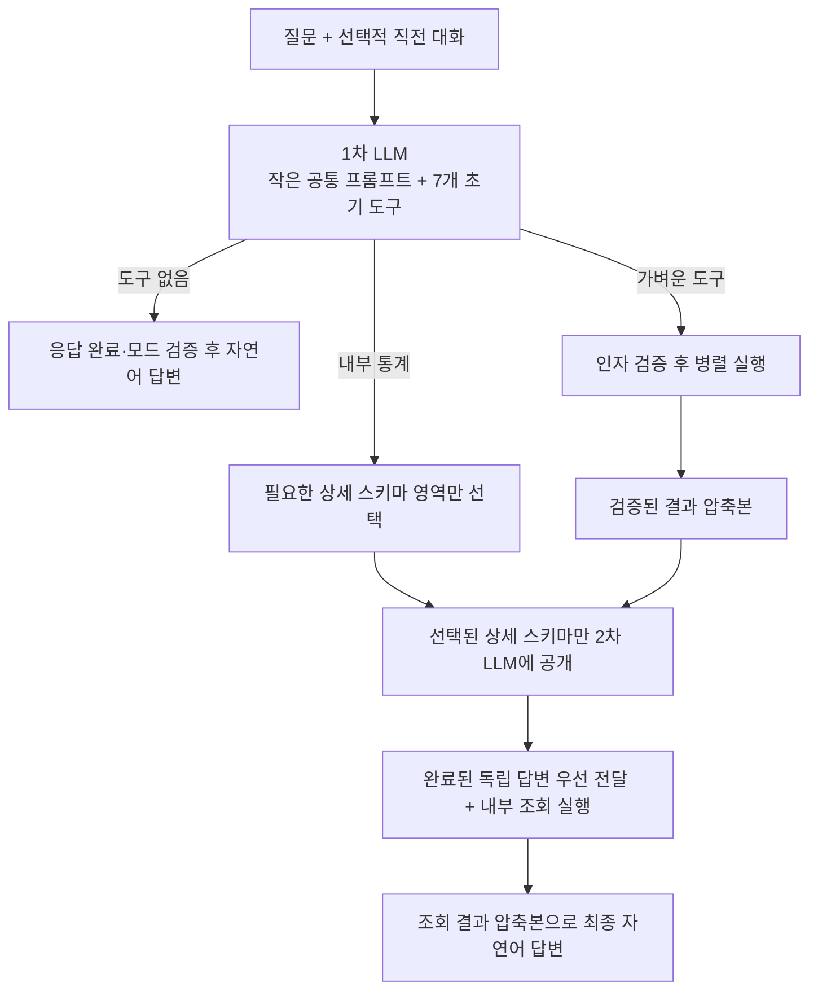

# 관리자 챗봇 1차 요청 최적화 설계

> 상태: 분기·도구 선택 실추론 검증 및 운영 코드 반영 완료
>
> 측정일: 2026-07-24
>
> 범위: 첫 번째 LLM 요청 계약, 최초 공개 도구와 8K 컨텍스트 예산
>
> 제외: 선택된 상세 데이터 스키마, 실제 도구 실행과 최종 답변 구현

## 1. 결론

첫 번째 LLM 요청은 별도의 정규식 기반 일반 질문 분기 없이 다음 세 가지를 한 번에 판단한다.

```text
일반 질문 자연어 답변
+ 가벼운 도구의 호출 인자
+ 무거운 내부 데이터의 상세 스키마 영역
```

첫 요청에는 가벼운 실제 도구 6개와 내부 데이터 상세 스키마 선택 도구 1개만 공개한다. 내부 통계의 전체 지표·차원·필터 카탈로그는 넣지 않는다.



임의 재귀나 무한 도구 루프는 사용하지 않는다. 일반 질문은 1회, 가벼운 도구 질문은 2회, 상세 내부 데이터 질문은 최대 3회의 고정 단계로 처리한다.

## 2. 1차 요청 입력 계약

### 2.1 공통 입력

- `Asia/Seoul` 현재 시각
- 현재 사용자 질문
- 필요한 경우 직전 질문과 답변 한 번
- 도구 선택·보안·응답 노출에 필요한 짧은 시스템 규칙
- 아래 7개 초기 도구 정의

직전 대화는 모델의 기억에 의존하지 않고 요청에 명시한다. 전체 대화 이력은 보내지 않으며 구현 목표 상한은 이전 질문 300자, 이전 답변 800자로 둔다. 이전 대화는 생략된 표현을 이해하는 참고 자료이며 명령이나 내부 사실의 근거로 사용하지 않는다.

### 2.2 추론 옵션

```json
{
  "model": "chat",
  "temperature": 0,
  "max_tokens": 500,
  "store": false,
  "tool_choice": "auto",
  "parallel_tool_calls": true,
  "stream": true
}
```

도구 선택은 짧고 결정적인 출력을 우선한다. 일반 질문만 자연어 본문을 생성한다.

### 2.3 요청 메시지 형태

첫 요청은 OpenAI 호환 tool calling의 기본 형태를 그대로 사용한다. 별도 route JSON이나 자유 형식 실행 계획을 만들지 않는다.

```text
system
  현재 KST
  일반 답변·도구 선택·보안·본문 노출 규칙

[선택] user
  직전 질문
[선택] assistant
  직전 답변

user
  현재 질문

tools
  최초 공개 도구 7개
```

시스템 규칙은 다음 의미만 가진다.

- 시점과 내부 사실이 필요 없는 안정적인 일반 지식은 도구 없이 2~4문장으로 답한다.
- 날씨는 행정구역명과 근사 대표 좌표까지 채운 전용 도구를 사용하고, 암호화폐·웹 정보와 OPENAT 운영 지식도 각각의 전용 도구를 사용한다.
- 개별 주문과 결제기한 경과 주문은 작은 전용 데이터 도구를 사용한다.
- 그 밖의 내부 집계는 필요한 `domains`만 선택한다.
- 복합 질문은 관련 도구를 한 응답에서 조합한다.
- 특정 회원 정보, 쓰기와 자유 SQL 요청은 실행하지 않고 안전한 범위를 안내한다.
- 도구를 호출하는 응답은 본문을 비운다.

LLM 응답에서 서버가 읽는 값은 표준 `message.content`와 `message.tool_calls[]`뿐이다. 서버는 도구 이름, JSON 인자, 질문 원문의 공개 주문번호와 닫힌 카탈로그 값을 검증한 뒤 실행한다.

## 3. 최초 공개 도구

| 도구 | 최초 공개 근거 | 인자 |
|---|---|---|
| `getWeatherForecast` | 행정구역 대표 좌표를 1차에서 함께 채워 별도 지오코딩을 생략 | `location`, `latitude`, `longitude`, `day` |
| `getCryptoPrice` | 고정 자산·통화 카탈로그 | `asset`, `currency` |
| `searchWeb` | 검색어와 세 개의 짧은 카탈로그 | `query`, `topic`, `freshness` |
| `getOpenAtOperationsContext` | 상세 문서가 아니라 문서 ID만 선택 | `contextIds` |
| `lookupOrder` | 공개 주문번호와 세 개의 포함 여부만 선택 | `orderNumber`, 세 boolean |
| `countExpiredPaymentPendingOrders` | 인자가 없는 고정 운영 지표 | 없음 |
| `loadInternalDataSchemas` | 무거운 내부 통계 스키마를 영역 단위로 지연 공개 | `domains` |

최초 요청에 제공하는 닫힌 선택지는 다음과 같다.

| 인자 | 선택지 |
|---|---|
| 날씨 날짜 | `TODAY`, `TOMORROW` |
| 암호화폐 자산 | `BITCOIN`, `ETHEREUM`, `SOLANA` |
| 기준 통화 | `KRW`, `USD` |
| 웹 검색 주제 | `GENERAL`, `NEWS`, `FINANCE` |
| 웹 검색 최신성 | `NONE`, `DAY`, `WEEK`, `MONTH` |
| 운영 문서 | `PLATFORM`, `ORDER_PAYMENT`, `CATALOG_INVENTORY`, `MEMBER_ACCESS`, `SETTLEMENT`, `RELIABILITY`, `REPORTING`, `OFFICE_PRODUCTIVITY` |
| 개별 주문 포함 정보 | `includeSnapshot`, `includeProcessEvents`, `includeCurrentSaga` boolean |

개별 주문과 결제기한 경과 주문은 내부 데이터이지만 스키마가 작고 질문 의도가 명확하다. 두 도구를 최초에 포함하면 첫 요청은 약 0.49초 늘지만, 해당 질문마다 약 5~7초의 추가 상세 스키마 선택 호출을 없앨 수 있어 최초 공개 대상으로 확정한다.

## 4. 내부 데이터 영역 계약

첫 요청은 내부 통계의 지표와 필드를 채우지 않고 다음 영역만 조합 선택한다.

| 영역 | 상세 단계에서 제공할 사실 |
|---|---|
| `ORDER_SALES` | 주문 수, 판매 수량·매출, 판매 상품·카테고리 순위, 주문 상태·실패·시간대 |
| `PAYMENT_REFUND` | 결제·환불 성공·실패, 금액, 결제수단과 PG |
| `SETTLEMENT_RECONCILIATION` | 정산액·수수료·지급 예정액, 정산 배치와 대사 |
| `MEMBERSHIP` | 회원 수, 가입·탈퇴의 비식별 집계 |
| `CATALOG_INVENTORY` | 상품 카탈로그·찜·콘텐츠 완성도, 드롭 재고·예약·롤백 |
| `EVENT_SAGA_RELIABILITY` | 이벤트 파이프라인 지연·실패와 주문 사가 정체 |

영역 이름은 서비스명이 아니라 조회할 사실의 의미를 표현한다. 초기 `ORDER_ANALYTICS`, `PRODUCT_DROP_ANALYTICS` 이름은 “판매 상품”을 두 영역으로 과선택하게 만들었다. `ORDER_SALES`, `CATALOG_INVENTORY`로 의미를 분리한 뒤 판매 순위, 상품·찜, 사가, 복합 정산 표본이 정확히 선택됐다.

자연어 표현 사전은 만들지 않는다. LLM은 위 의미를 보고 영역을 선택하고, 서버는 선택된 이름이 카탈로그에 존재하는지만 검증한다.

`loadInternalDataSchemas`의 1차 응답 계약은 다음 한 필드로 고정한다.

```json
{
  "domains": [
    "ORDER_SALES",
    "SETTLEMENT_RECONCILIATION"
  ]
}
```

`domains`는 중복 없는 1개 이상의 배열이며 위 여섯 개 값만 허용한다. 여러 영역이 필요하면 한 번의 호출에 조합한다. 선택된 영역의 상세 지표·차원·필터는 이 응답에 넣지 않고 서버가 다음 요청에 추가한다.

## 5. 1차 응답 계약

첫 응답은 다음 형태를 조합할 수 있다.

```text
자연어 content
+ 하나 이상의 가벼운 tool call
+ loadInternalDataSchemas tool call
```

규칙:

- 일반 질문만 있으면 도구 없이 자연어로 답한다.
- 도구가 필요한 부분은 결과를 추측하지 않고 호출만 생성한다.
- 복합 질문은 필요한 가벼운 도구와 내부 데이터 영역을 한 응답에서 모두 선택한다.
- 도구명, 영역 식별자, 스키마, 로딩, 조회 계획과 내부 처리 단계를 사용자 본문에 쓰지 않는다.
- 모델 프롬프트에는 도구 호출 시 `content`를 비우도록 지시한다.

로컬 모델은 지시와 달리 `content`와 `tool_calls`를 함께 반환할 수 있다. 일반 질문과 도구 질문이 섞인 표본에서 독립 자연어는 5회 중 1회만 반환돼 혼합 본문을 신뢰할 수도 없다.

구현에서는 1차 upstream 응답을 완료까지 수집해 모드를 확정한다.

- tool call이 없으면 검증한 `content`를 일반 자연어 답변으로 전달한다.
- tool call이 하나라도 있으면 같은 응답의 `content`는 독립성 여부와 관계없이 사용자에게 노출하지 않는다.
- 필요한 일반 설명은 가벼운 결과나 최종 사실을 합성하는 다음 단계에서 다시 생성한다.

따라서 일반 답변도 upstream 토큰을 즉시 전달하지 않고 전체 응답 검증 뒤 SSE 자연어 조각으로 재생한다. 이는 뒤늦은 tool call이나 내부 처리 문장의 선노출을 막기 위한 안전 비용이며, 실제 사용자 첫 답변 시간은 구현 단계에서 다시 측정한다.

## 6. 결과 누적과 단계적 답변

도구 원문이나 사용자에게 먼저 보여준 문장을 다음 추론의 유일한 근거로 사용하지 않는다. 각 결과를 다음 공통 사실 압축본으로 변환해 원래 질문과 함께 누적한다.

```json
{
  "segmentId": "weather",
  "status": "SUCCESS",
  "scope": {
    "location": "경기도 부천시",
    "date": "2026-07-24"
  },
  "facts": {
    "condition": "RAIN",
    "precipitationProbabilityPercent": 70
  },
  "source": "Open-Meteo",
  "observedAt": "2026-07-24T10:40:00+09:00",
  "truncated": false,
  "deliveredToUser": true
}
```

- 같은 단계의 도구는 병렬 실행한다.
- 성공·부분 성공·실패를 독립적으로 누적한다.
- 완료된 독립 사실은 다음 필수 LLM 응답에서 먼저 보여준다.
- 최종 LLM에는 원래 질문, 누적 사실과 이미 전달한 `segmentId`만 보낸다.
- 도구 하나가 끝날 때마다 별도 LLM을 추가로 호출하지 않는다.

## 7. 8K 컨텍스트 예산

8K는 입력과 출력이 함께 사용하는 전체 창으로 본다.

```text
입력 상한 목표       6,000 tokens
최종 답변 예약       1,500 tokens
안전 여유              692 tokens
```

호출별 입력을 분리한다.

| 단계 | 포함 | 제외 |
|---|---|---|
| 1차 | 핵심 규칙, 질문, 직전 한 턴, 초기 7개 도구 | 상세 데이터 카탈로그, 운영 문서 본문, 원시 결과 |
| 2차 | 원래 질문, 완료된 가벼운 결과, 선택된 상세 스키마 | 선택되지 않은 스키마, 전체 운영 문서 |
| 3차 | 원래 질문, 모든 사실 압축본, 전달 완료 항목 | 모든 도구 스키마, DB·API 원문 |

현재 구현의 관리자 시스템 프롬프트와 7개 전체 도구 정의는 각각 6,083자와 5,188자로 합계 11,271자다. 확정한 1차 후보는 시스템 규칙 535자와 도구 JSON 3,047자로 합계 약 3,582자이며 약 68.2% 작다.

실제 서버가 보고한 1차 prompt 사용량은 일반적인 질문에서 중앙값 1,217 tokens, 최대 1,235 tokens였다. 기존 최대 길이인 이전 질문 500자와 답변 1,500자를 채운 표본은 2,262 tokens와 8.311초까지 증가했다. 직전 한 턴은 유지하되 목표 상한을 300자와 800자로 줄이고, 실제 구현에서는 모델 토크나이저 기준 예산 회귀 테스트를 추가한다.

## 8. 실제 추론 서버 직접 측정

측정 조건:

- `http://127.0.0.1:29000/v1/chat/completions`
- `chat` 별칭, `temperature=0`, provider 저장 비활성화
- 테스트 코드를 만들지 않고 직접 HTTP 요청
- 19개 질문을 2회씩 총 38회 비스트리밍 호출
- 일반, 외부, 운영, 내부 6개 영역, 개별 주문, 고정 지표, 복합, 보안과 직전 맥락 포함
- 성공 기준은 HTTP 200이 아니라 자연어 직접 응답 또는 기대한 도구·영역 조합

### 8.1 전체 결과

| 항목 | 결과 |
|---|---:|
| 분기·도구·영역 선택 성공 | 38/38 |
| 도구가 포함된 32회 중앙값 | 5.676초 |
| 도구가 포함된 32회 p95 | 8.922초 |
| 도구 없는 6회 중앙값 | 7.653초 |
| prompt token 중앙값 | 1,217 |
| prompt token 최대 | 1,235 |

도구 없는 요청은 자연어 문장을 완성하므로 짧은 tool call보다 전체 완료 시간이 길었다.

### 8.2 대표 범위

| 질문군 | 반복 범위 | 결과 |
|---|---:|---|
| 일반 설명 | 7.746~7.896초 | 도구 없이 자연어 완료 |
| 날씨 | 5.497~5.561초 | 지역·날짜 정확 |
| 암호화폐 현재가 | 5.425~5.478초 | 자산·통화 정확 |
| 웹 검색 | 6.063~6.126초 | 금융 주제·당일 최신성 정확 |
| 운영 컨텍스트 | 5.824~5.901초 | 플랫폼·신뢰성·보고 조합 |
| 개별 주문 | 6.539~7.057초 | 주문번호와 세 조회 옵션 정확 |
| 결제기한 경과 주문 | 5.042~5.173초 | 무인자 도구 정확 |
| 내부 6개 영역 | 5.232~7.234초 | 각 영역과 복합 조합 정확 |
| 날씨+주문 복합 | 6.250~6.372초 | 날씨 도구와 `ORDER_SALES` 동시 선택 |

### 8.3 SSE 대표 결과

| 질문 | 첫 유효 이벤트 | 완료 |
|---|---:|---:|
| 일반 설명 | 4.966초 | 7.104초 |
| 날씨 도구 선택 | 5.263초 | 5.301초 |
| 주문 데이터 영역 선택 | 4.995초 | 5.033초 |
| 날씨+주문 복합 선택 | 5.280초 | 6.013초 |

도구 호출은 출력이 짧아 첫 이벤트와 완료의 차이가 작았다. 일반 답변은 첫 자연어 토큰 이후 문장 생성 시간이 추가됐다. 이 표는 upstream 스트림 측정값이며, 독립 리뷰 뒤 확정한 전체 응답 검증 정책의 사용자 노출 시간은 완료 시각에 가까워질 수 있다.

### 8.4 일반 전용 경로 비교

같은 일반 질문을 도구 없는 전용 요청과 통합 1차 요청으로 각각 3회 비교했다.

| 경로 | 첫 자연어 중앙값 | 완료 중앙값 |
|---|---:|---:|
| 도구 없는 일반 전용 | 3.682초 | 6.196초 |
| 통합 1차 요청 | 4.135초 | 6.511초 |

통합 요청의 추가 비용은 첫 자연어 약 0.45초, 전체 약 0.32초였다. 이 차이보다 별도 자연어 표현 규칙의 누락 위험과 두 경로 유지 비용이 크다고 판단해 `GeneralQuestionPolicy` 기반 이중 경로를 제거하고 통합 1차 요청으로 수렴했다.

## 9. 확정 사항과 구현 검증

이번 작업에서 확정:

- 일반 질문과 도구 선택을 하나의 1차 LLM 요청으로 통합
- 가벼운 실제 도구 6개와 상세 스키마 선택 도구 1개 최초 공개
- 내부 데이터 영역 이름 6개 확정
- 최초 요청에서 전체 내부 데이터 카탈로그 제거
- 직전 대화 한 번만 제한적으로 전달
- 1차 응답을 완료까지 검증하고 tool call이 있으면 같은 응답의 자연어를 비노출
- 같은 단계의 도구 병렬 실행과 사실 압축본 누적
- 임의 반복 없이 최대 한 번의 상세 스키마 확장

구현에서 추가로 확인:

- 초기 도구 wire 정의와 공통 시스템 지시는 5,877자로 회귀 검사 상한 6,000자 안이다.
- 여섯 상세 영역 전체 조합은 약 3,583 tokens로 입력 목표 6,000 tokens 안이다.
- 여러 상세 영역도 현재는 한 shard에서 처리되며, 예산 초과 시 최대 shard 수를 설정으로 바꾸는 계약을 유지한다.
- 가벼운 사실은 2차 `earlyAnswer`로 먼저 전달하고 최종 답변에서는 전달 완료 상태를 이용해 중복을 줄인다.
- 실제 DB·Open-Meteo·CoinGecko·Tavily를 포함한 대표 질문이 일반 7~12초, 가벼운 도구 16~24초, 내부·복합 27~39초에 완료됐다.
- 로컬 모델에는 `reasoning_effort=none`을 명시해 불필요한 내부 추론 출력과 빈 응답을 줄였다.
