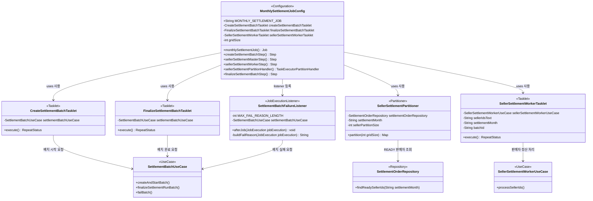
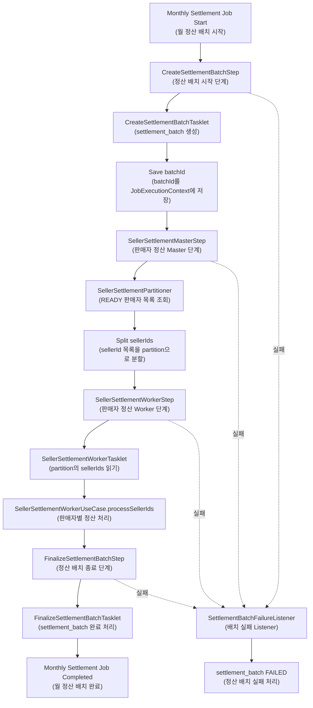

# Monthly Settlement Batch Source Analysis  
# 월 정산 배치 소스 분석

## 1. 문서 개요

이 문서는 첨부된 배치 소스를 기준으로 **월 정산 배치 구조**, **클래스 다이어그램**, **클래스별 역할**, **배치 실행 단계**, **실패 처리 흐름**, **트랜잭션 주의점**을 쉽게 정리한 문서입니다.

분석 대상 클래스는 다음과 같습니다.

| No | Class | 한글명 | 역할 |
|---:|---|---|---|
| 1 | `MonthlySettlementJobConfig` | 월 정산 Job 설정 클래스 | Spring Batch Job과 Step 실행 순서 설정 |
| 2 | `CreateSettlementBatchTasklet` | 정산 배치 시작 Tasklet | `settlement_batch` 생성 및 `batchId` 저장 |
| 3 | `SellerSettlementPartitioner` | 판매자 분할 Partitioner | READY 상태 판매자 목록 조회 후 partition 분할 |
| 4 | `SellerSettlementWorkerTasklet` | 판매자 정산 Worker Tasklet | partition에 포함된 sellerId 목록 정산 처리 |
| 5 | `FinalizeSettlementBatchTasklet` | 정산 배치 종료 Tasklet | 배치 완료 처리 |
| 6 | `SettlementBatchFailureListener` | 정산 배치 실패 Listener | Job 실패 시 배치 상태 FAILED 처리 |

---

## 2. 전체 배치 구조 요약

이 배치는 **월 정산을 실행하는 Spring Batch Job**입니다.

전체 흐름은 다음과 같습니다.

```text
월 정산 Job 시작
  ↓
1. settlement_batch 생성
  ↓
2. READY 상태 판매자 목록 조회
  ↓
3. sellerId 목록을 partition 단위로 분리
  ↓
4. Worker Step들이 병렬로 판매자 정산 처리
  ↓
5. settlement_batch 완료 처리
  ↓
실패 시 SettlementBatchFailureListener가 FAILED 처리
```

쉽게 말하면, 이 배치는 다음 역할을 합니다.

```text
이번 달 정산을 시작했다는 기록을 만들고,
정산 가능한 판매자 목록을 나눈 다음,
여러 Worker가 병렬로 판매자 정산을 처리하고,
마지막에 정산 배치를 완료 처리하는 구조입니다.
```

---

## 3. Class Diagram  
## 클래스 다이어그램



---

## 4. 클래스별 설명

### 4.1 `MonthlySettlementJobConfig`  
### 월 정산 Job 설정 클래스

`MonthlySettlementJobConfig`는 Spring Batch의 Job과 Step을 설정하는 클래스입니다.

이 클래스에서 월 정산 배치의 실행 순서가 결정됩니다.

```java
.start(createSettlementBatchStep)
.next(sellerSettlementMasterStep)
.next(finalizeSettlementBatchStep)
.listener(settlementBatchFailureListener)
```

실행 순서는 다음과 같습니다.

```text
createSettlementBatchStep
  ↓
sellerSettlementMasterStep
  ↓
finalizeSettlementBatchStep
```

그리고 Job이 실패하면 `SettlementBatchFailureListener`가 실행됩니다.

#### 주요 역할

| 항목 | 설명 |
|---|---|
| Job 생성 | `monthlySettlementJob` 생성 |
| Step 순서 설정 | 시작 Step → 판매자 정산 Step → 종료 Step |
| 병렬 처리 설정 | `TaskExecutorPartitionHandler`로 Worker Step 병렬 실행 |
| 실패 Listener 등록 | Job 실패 시 FAILED 처리 가능 |

---

### 4.2 `CreateSettlementBatchTasklet`  
### 정산 배치 시작 Tasklet

`CreateSettlementBatchTasklet`은 월 정산 배치가 시작될 때 실행됩니다.

이 클래스는 `settlementMonth` 값을 JobParameter에서 꺼낸 후, 정산 배치 시작 이력을 생성합니다.

```java
String settlementMonth = contribution.getStepExecution()
        .getJobParameters()
        .getString("settlementMonth");
```

그 다음 `SettlementBatchUseCase`를 호출합니다.

```java
SettlementBatch batch = settlementBatchUseCase.createAndStartBatch(
        new CreateSettlementBatchCommand(
                settlementMonth,
                SettlementBatchType.SETTLEMENT_RUN
        )
);
```

마지막으로 생성된 `batchId`를 `JobExecutionContext`에 저장합니다.

```java
contribution.getStepExecution()
        .getJobExecution()
        .getExecutionContext()
        .putString("batchId", batch.getId().toString());
```

#### 쉽게 설명

```text
"202605월 정산을 시작합니다" 라는 배치 이력을 DB에 만들고,
생성된 batchId를 다음 Step들이 사용할 수 있도록 저장합니다.
```

#### 저장되는 값 예시

```text
settlementMonth = 202605
batchType = SETTLEMENT_RUN
batchStatus = RUNNING 또는 STARTED
batchId = 생성된 정산 배치 ID
```

---

### 4.3 `SellerSettlementPartitioner`  
### 판매자 분할 Partitioner

`SellerSettlementPartitioner`는 정산 대상 판매자 목록을 조회하고, 여러 개의 partition으로 나누는 클래스입니다.

먼저 정산월 기준으로 READY 상태의 판매자 목록을 조회합니다.

```java
List<UUID> sellerIds = settlementOrderRepository.findReadySellerIds(settlementMonth);
```

그리고 `seller-partition-size` 설정값 기준으로 sellerId 목록을 나눕니다.

```java
@Value("${settlement.batch.seller-partition-size}")
private int sellerPartitionSize;
```

예를 들어 설정이 아래와 같다고 가정합니다.

```yaml
settlement:
  batch:
    seller-partition-size: 100
```

판매자 1,000명이 있으면 다음처럼 나뉩니다.

```text
sellerPartition-0 : seller 1 ~ 100
sellerPartition-1 : seller 101 ~ 200
sellerPartition-2 : seller 201 ~ 300
...
sellerPartition-9 : seller 901 ~ 1000
```

각 partition에는 `sellerIds` 문자열이 들어갑니다.

```java
context.putString("sellerIds", sellerIdsText);
```

#### 쉽게 설명

```text
정산할 판매자가 너무 많으면 한 번에 처리하기 어렵기 때문에,
판매자 목록을 여러 박스로 나눠서 Worker에게 넘기는 역할입니다.
```

---

### 4.4 `SellerSettlementWorkerTasklet`  
### 판매자 정산 Worker Tasklet

`SellerSettlementWorkerTasklet`은 partition 하나에 들어온 sellerId 목록을 실제 정산 처리 UseCase로 넘기는 클래스입니다.

Partitioner가 넘겨준 sellerIds를 받습니다.

```java
@Value("#{stepExecutionContext['sellerIds']}")
private String sellerIdsText;
```

예를 들어 값은 다음처럼 들어옵니다.

```text
sellerId1,sellerId2,sellerId3
```

이 문자열을 UUID 리스트로 변환합니다.

```java
List<UUID> sellerIds = Arrays.stream(sellerIdsText.split(","))
        .filter(value -> !value.isBlank())
        .map(UUID::fromString)
        .toList();
```

그리고 실제 정산 처리는 `SellerSettlementWorkerUseCase`에 위임합니다.

```java
sellerSettlementWorkerUseCase.processSellerIds(
        new ProcessSellerIdsCommand(
                UUID.fromString(batchId),
                settlementMonth,
                sellerIds
        )
);
```

#### 쉽게 설명

```text
Worker는 partition에 들어있는 판매자 목록을 읽고,
"이 판매자들을 정산 처리해주세요"라고 UseCase에 넘깁니다.
```

실제 정산 계산 로직은 이 Tasklet 안에 있지 않고, `SellerSettlementWorkerUseCase` 내부에 있습니다.

예상되는 내부 처리 흐름은 다음과 같습니다.

```text
sellerId별 settlement_order 조회
  ↓
주문금액 합산
  ↓
수수료 합산
  ↓
환불금액 합산
  ↓
보정금액 합산
  ↓
최종 정산금액 계산
  ↓
seller_settlement 저장
  ↓
settlement_order COMPLETED 처리
  ↓
settlement_adjustment APPLIED 처리
```

---

### 4.5 `FinalizeSettlementBatchTasklet`  
### 정산 배치 종료 Tasklet

`FinalizeSettlementBatchTasklet`은 모든 판매자 정산 처리가 끝난 뒤 실행됩니다.

앞 단계에서 저장한 `batchId`를 `JobExecutionContext`에서 꺼냅니다.

```java
String batchId = contribution.getStepExecution()
        .getJobExecution()
        .getExecutionContext()
        .getString("batchId");
```

그리고 `SettlementBatchUseCase`를 호출해서 배치를 완료 처리합니다.

```java
settlementBatchUseCase.finalizeSettlementRunBatch(
        new FinalizeSettlementBatchCommand(UUID.fromString(batchId))
);
```

#### 쉽게 설명

```text
모든 판매자 정산 처리가 끝났으니,
settlement_batch 상태를 COMPLETED로 바꾸는 단계입니다.
```

---

### 4.6 `SettlementBatchFailureListener`  
### 정산 배치 실패 Listener

`SettlementBatchFailureListener`는 Job이 실패했을 때 실행되는 Listener입니다.

Job 상태가 `FAILED`가 아니면 아무것도 하지 않습니다.

```java
if (jobExecution.getStatus() != BatchStatus.FAILED) {
    return;
}
```

실패한 경우에는 `JobExecutionContext`에서 `batchId`를 가져옵니다.

```java
String batchIdText = jobExecution.getExecutionContext().getString("batchId", null);
```

만약 배치 시작 전에 실패해서 `batchId`가 없으면 로그만 남기고 종료합니다.

```java
if (batchIdText == null || batchIdText.isBlank()) {
    log.warn("Monthly settlement job failed before settlement batch was created...");
    return;
}
```

`batchId`가 있으면 실패 원인을 만들고, 배치 상태를 FAILED로 변경합니다.

```java
settlementBatchUseCase.failBatch(
        new FailSettlementBatchCommand(UUID.fromString(batchIdText), reason)
);
```

실패 원인은 최대 500자까지만 저장합니다.

```java
private static final int MAX_FAIL_REASON_LENGTH = 500;
```

#### 쉽게 설명

```text
배치 중간에 실패하면 settlement_batch가 RUNNING 상태로 남으면 안 됩니다.
그래서 Listener가 실패를 감지하고 settlement_batch를 FAILED 상태로 바꿔줍니다.
```

---

## 5. Batch Flow Chart  
## 배치 단계 플로우 차트



---

## 6. 성공 흐름 상세

### Step 1. 월 정산 Job 시작

Job 이름은 다음 상수로 정의되어 있습니다.

```java
public static final String MONTHLY_SETTLEMENT_JOB = "monthlySettlementJob";
```

배치 실행 시에는 `settlementMonth`가 JobParameter로 전달되어야 합니다.

예시:

```text
settlementMonth = 202605
```

---

### Step 2. 정산 배치 시작 이력 생성

`CreateSettlementBatchTasklet`이 실행되어 `settlement_batch`를 생성합니다.

```text
settlement_batch 생성
  ↓
batchId 생성
  ↓
batchId를 JobExecutionContext에 저장
```

이 `batchId`는 이후 Worker Step과 Finalize Step에서 사용됩니다.

---

### Step 3. READY 판매자 목록 조회

`SellerSettlementPartitioner`가 `settlement_order` 기준으로 정산 가능한 판매자 목록을 조회합니다.

```java
settlementOrderRepository.findReadySellerIds(settlementMonth)
```

즉, 정산월에 READY 상태 주문이 있는 sellerId들을 조회합니다.

---

### Step 4. sellerId 목록 분할

조회된 sellerId 목록은 `seller-partition-size` 기준으로 나뉩니다.

```text
전체 sellerId 목록
  ↓
100개씩 분할
  ↓
sellerPartition-0
sellerPartition-1
sellerPartition-2
...
```

---

### Step 5. Worker Step 병렬 실행

`TaskExecutorPartitionHandler`가 Worker Step을 병렬로 실행합니다.

```java
handler.setStep(sellerSettlementWorkerStep);
handler.setTaskExecutor(settlementTaskExecutor);
handler.setGridSize(gridSize);
```

`gridSize`는 application.yml 설정값을 사용합니다.

```java
@Value("${settlement.batch.grid-size}")
private int gridSize;
```

예를 들어 `grid-size = 4`라면 Worker가 동시에 여러 partition을 처리할 수 있습니다.

```text
Worker 1 → sellerPartition-0 처리
Worker 2 → sellerPartition-1 처리
Worker 3 → sellerPartition-2 처리
Worker 4 → sellerPartition-3 처리
```

---

### Step 6. 판매자 정산 처리

`SellerSettlementWorkerTasklet`이 partition에 들어온 sellerId 목록을 읽고, `SellerSettlementWorkerUseCase`에 처리를 위임합니다.

```text
partition sellerIds 읽기
  ↓
UUID 리스트로 변환
  ↓
ProcessSellerIdsCommand 생성
  ↓
SellerSettlementWorkerUseCase.processSellerIds() 호출
```

---

### Step 7. 배치 완료 처리

모든 Worker Step이 성공하면 `FinalizeSettlementBatchTasklet`이 실행됩니다.

```text
batchId 조회
  ↓
finalizeSettlementRunBatch() 호출
  ↓
settlement_batch 완료 처리
```

최종적으로 배치 상태는 다음처럼 변경됩니다.

```text
RUNNING → COMPLETED
```

---

## 7. 실패 흐름 상세

배치 중간에 실패하면 Job 상태가 `FAILED`가 됩니다.

그 후 `SettlementBatchFailureListener.afterJob()`이 실행됩니다.

```text
Job 실패
  ↓
SettlementBatchFailureListener 실행
  ↓
batchId 조회
  ↓
실패 원인 생성
  ↓
settlementBatchUseCase.failBatch() 호출
  ↓
settlement_batch FAILED 처리
```

최종 상태는 다음과 같습니다.

```text
RUNNING → FAILED
```

단, `CreateSettlementBatchTasklet` 실행 전에 실패했다면 아직 `batchId`가 없으므로 DB 상태 변경은 하지 않고 로그만 남깁니다.

---

## 8. 트랜잭션 처리 주의점

현재 소스 기준으로 각 Tasklet Step은 다음처럼 transactionManager를 사용합니다.

```java
.tasklet(createSettlementBatchTasklet, transactionManager)
.tasklet(sellerSettlementWorkerTasklet, transactionManager)
.tasklet(finalizeSettlementBatchTasklet, transactionManager)
```

따라서 기본적으로 Step 실행 단위로 트랜잭션이 걸립니다.

특히 Worker Step은 partition 하나에 포함된 sellerId 목록을 한 번에 처리합니다.

```text
sellerSettlementWorkerStep 1번 실행
  ↓
partition 하나 처리
  ↓
sellerId 여러 명 처리
```

예를 들어 `seller-partition-size = 100`이면 Worker Step 하나가 sellerId 100명을 처리할 수 있습니다.

이때 `SellerSettlementWorkerUseCase` 내부에서 별도 트랜잭션 분리를 하지 않으면, 다음처럼 동작할 수 있습니다.

```text
Worker Step 트랜잭션 시작
  ↓
seller 1 처리
seller 2 처리
seller 3 처리
...
seller 100 처리
  ↓
Worker Step 트랜잭션 커밋
```

즉, 판매자 100명이 하나의 트랜잭션으로 묶일 수 있습니다.

문제는 중간에 한 판매자가 실패했을 때입니다.

```text
seller 1 성공
seller 2 성공
seller 3 실패
```

판매자별 트랜잭션이 분리되어 있지 않으면 다음처럼 될 수 있습니다.

```text
seller 1 롤백
seller 2 롤백
seller 3 실패
```

그래서 정산 배치에서는 보통 판매자 1명 단위로 트랜잭션을 분리하는 것이 더 안전합니다.

권장 구조는 다음과 같습니다.

```text
Worker Step 실행
  ↓
seller 1 별도 트랜잭션 시작 → 처리 성공 → 커밋
seller 2 별도 트랜잭션 시작 → 처리 성공 → 커밋
seller 3 별도 트랜잭션 시작 → 처리 실패 → 롤백 / 실패 기록
seller 4 별도 트랜잭션 시작 → 처리 성공 → 커밋
```

즉, partition은 병렬 처리를 위한 묶음이고, 실제 DB 트랜잭션은 sellerId 1명 단위로 분리하는 것이 좋습니다.

---

## 9. application.yml 설정 예시

현재 소스에서 사용하는 설정값은 다음과 같습니다.

```yaml
settlement:
  batch:
    grid-size: 4
    seller-partition-size: 100
```

| 설정 | 의미 |
|---|---|
| `settlement.batch.grid-size` | 동시에 실행할 partition Worker 개수 |
| `settlement.batch.seller-partition-size` | partition 하나에 들어갈 sellerId 개수 |

예시 의미는 다음과 같습니다.

```text
grid-size = 4
seller-partition-size = 100
```

이면,

```text
판매자 목록을 100명씩 나누고,
최대 4개 partition을 병렬로 처리합니다.
```

---

## 10. 핵심 요약

이 배치 소스는 다음 구조입니다.

```text
MonthlySettlementJobConfig
= 월 정산 배치 전체 순서 설정

CreateSettlementBatchTasklet
= 정산 배치 시작 이력 생성

SellerSettlementPartitioner
= READY 판매자 목록 조회 후 partition 분리

SellerSettlementWorkerTasklet
= partition에 들어온 판매자 목록을 정산 처리 UseCase에 위임

FinalizeSettlementBatchTasklet
= 배치 완료 처리

SettlementBatchFailureListener
= Job 실패 시 settlement_batch FAILED 처리
```

가장 중요한 흐름은 다음과 같습니다.

```text
정산 배치 시작
  ↓
배치 이력 생성
  ↓
READY 판매자 조회
  ↓
판매자 목록 partition 분리
  ↓
Worker 병렬 처리
  ↓
배치 완료
```

실패하면 다음 흐름이 추가됩니다.

```text
배치 실패
  ↓
FailureListener 실행
  ↓
실패 원인 저장
  ↓
settlement_batch FAILED 처리
```

---

## 11. 최종 결론

현재 배치 구조는 월 정산 배치의 기본 골격으로 적절합니다.

장점은 다음과 같습니다.

1. 배치 시작, 판매자 정산, 배치 종료 단계가 분리되어 있습니다.
2. 판매자 목록을 partition으로 나누어 병렬 처리할 수 있습니다.
3. `grid-size`, `seller-partition-size`를 설정값으로 관리합니다.
4. 실패 시 `SettlementBatchFailureListener`가 배치 상태를 FAILED로 변경합니다.
5. 실패한 sellerId만 재처리할 수 있는 구조.
6. `settlement_batch` 상태가 RUNNING으로 남지 않도록 실패 Listener 처리는 유지.

다만 안정적인 운영을 위해서는 다음을 확인하는 것이 좋습니다.

1. `settlementTaskExecutor` Bean이 별도로 정의되어 있어야 합니다.
2. `SellerSettlementWorkerUseCase` 내부에서 판매자 1명 단위 트랜잭션 분리가 필요합니다.
