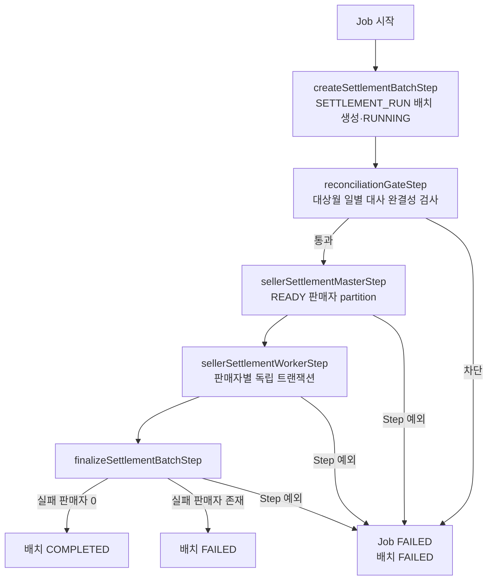

# 월 정산 Spring Batch 설계

> 2026-07-27 `dev` 구현 기준. 소스 기준점은 `MonthlySettlementJobConfig`,
> `MonthlyReconciliationGateService`, `SellerSettlementWorkerService`다.

## 실행 조건

| 항목 | 현재 값 |
|---|---|
| 자동 실행 | 매월 1일 03:00, `0 0 3 1 * *` (JVM 기본 시간대) |
| 자동 대상월 | JVM 기본 날짜 기준 실행일의 전월, `yyyyMM` |
| 수동 실행 | `POST /api/v1/settlements/admin/monthly/run?settlementMonth=yyyyMM` |
| Job 이름 | `monthlySettlementJob` |
| Job 자동 기동 | `spring.batch.job.enabled=false`; Scheduler 또는 API가 명시적으로 실행 |
| partition당 판매자 | 50명 |
| 판매자 주문 조회 chunk | 1,000건 |
| partition grid | 2 |
| 수수료율 | 결제금액의 3%, 원 미만 버림 |

자동·수동 실행 모두 `requestedAt`을 Job Parameter에 넣어 같은 정산월을 다시 실행할 수 있다.
수동 실행은 `settlementMonth` 형식을 먼저 검증하고, 자동 실행과 같은 대사 gate를 통과해야 한다.

> 경로 이름은 `admin`이지만 현재 Gateway는 정산 관리자 GET에만 ADMIN 역할을 강제한다.
> `monthly/run`·`retry-failed`·`reconciliation/run` POST는 일반 access JWT만 있으면 통과하고,
> settlement 서비스 자체는 모든 경로를 `permitAll`한다. 운영 전 Gateway 인가 보강이 필요하다.

## 전체 흐름


```mermaid
flowchart TD
    A["Job 시작"] --> B["createSettlementBatchStep<br/>SETTLEMENT_RUN 배치 생성·RUNNING"]
    B --> C["reconciliationGateStep<br/>대상월 일별 대사 완결성 검사"]
    C -->|통과| D["sellerSettlementMasterStep<br/>READY 판매자 partition"]
    C -->|차단| X["Job FAILED<br/>배치 FAILED"]
    D --> E["sellerSettlementWorkerStep<br/>판매자별 독립 트랜잭션"]
    E --> F["finalizeSettlementBatchStep"]
    F -->|실패 판매자 0| G["배치 COMPLETED"]
    F -->|실패 판매자 존재| H["배치 FAILED"]
    D -->|Step 예외| X
    E -->|Step 예외| X
    F -->|Step 예외| X
```

실행 순서는 코드상 아래 네 Step으로 고정돼 있다.

```text
createSettlementBatchStep
  → reconciliationGateStep
  → sellerSettlementMasterStep
  → finalizeSettlementBatchStep
```

## Step별 동작

### 1. 배치 생성

`CreateSettlementBatchTasklet`이 `SettlementBatchType.SETTLEMENT_RUN` 배치를 만들고 즉시
`RUNNING`으로 전이한다. 생성된 `batchId`는 Job `ExecutionContext`에 문자열로 저장돼
Worker와 Finalize Step이 공유한다.

대사 gate보다 배치 생성이 먼저다. 따라서 gate에서 차단돼도 실행 시도와 실패 이유가
`settlement_batchs`에 남는다.

### 2. 월 대사 gate

`ReconciliationGateTasklet`은 대상월의 1일부터 말일까지
`daily_reconciliation_results`를 검사한다. 다음 중 하나라도 해당하면
`BATCH_RECONCILIATION_BLOCKED`로 Job을 중단한다.

- 날짜별 대사 결과가 한 건이라도 없음
- 상태가 `SUCCESS`가 아님
- `discrepancy_count`가 0보다 큼

이는 JVM 기본 시간대 기준 매일 02:00에 수행되는 정산 대사가 한 달 전체에 대해 정상 완료된 뒤에만 월 정산을
허용하는 안전장치다.

### 3. 판매자 partition

`SellerSettlementPartitioner`가 대상월의 `READY` 정산 주문에서 판매자 ID를 조회하고
50명씩 묶어 `sellerPartition-N` ExecutionContext를 만든다. 판매자 ID 목록은 쉼표로
직렬화해 Worker Step에 전달한다.

`TaskExecutorPartitionHandler`는 `settlementTaskExecutor`를 사용한다. 현재 executor는
core 2, max 4, queue 100이고 handler grid size는 2다.

### 4. 판매자별 정산

`SellerSettlementWorkerTasklet`이 partition의 판매자 ID를 복원한 뒤
`SellerSettlementWorkerService`에 전달한다.

판매자 한 명의 정산은 `REQUIRES_NEW` 트랜잭션이다.

1. 같은 `sellerId + settlementMonth`의 기존 결과를 조회한다.
2. 이미 `COMPLETED`면 멱등하게 종료한다.
3. `READY` 주문 금액을 1,000건씩 읽어 결제·수수료·환불 금액을 합산한다.
4. `READY` 보정 금액을 합산한다.
5. 새 결과를 만들거나 기존 `FAILED` 결과를 재계산해 `COMPLETED`로 저장한다.
6. 대상 주문을 `COMPLETED`로 바꾸고 `seller_settlement_id`를 연결한다.
7. 사용한 보정을 `APPLIED`로 바꾼다.

계산식:

```text
finalSettlementAmount
  = totalPaidAmount
  - totalFeeAmount
  - totalRefundAmount
  + totalAdjustmentAmount
```

한 판매자 처리에서 예외가 나면 Worker 전체를 즉시 중단하지 않는다.
`SellerSettlementFailureRecorder`가 별도 `REQUIRES_NEW` 트랜잭션으로 해당 판매자 결과를
`FAILED`로 남기고 다음 판매자를 계속 처리한다.

### 5. 배치 종료

`FinalizeSettlementBatchTasklet`이 같은 `batchId`의 판매자 결과를 집계한다.

- `FAILED` 판매자가 없으면 주문 수·판매자 수·완료 결과 금액을 합산해 배치를 `COMPLETED` 처리
- `FAILED` 판매자가 있으면 `failedSellerCount`, `totalSellerCount`를 이유로 배치를 `FAILED` 처리

판매자 단위 오류를 Worker가 흡수하더라도 최종 배치 상태는 성공으로 오인되지 않는다.

## 실패 처리

`SettlementBatchFailureListener`는 Spring Batch Job 자체가 `FAILED`로 끝날 때 동작한다.

- Job ExecutionContext에 `batchId`가 있으면 예외 목록을 합쳐 배치를 `FAILED`로 바꾼다.
- 실패 이유는 최대 500자로 자른다.
- 배치 생성 전에 실패해 `batchId`가 없으면 DB 상태를 바꿀 대상이 없으므로 경고 로그만 남긴다.

판매자 단위 실패와 Job/Step 실패는 처리 경로가 다르다.

| 실패 범위 | 기록 | 후속 동작 |
|---|---|---|
| 판매자 1명 | `seller_settlements.status=FAILED` | 다른 판매자 계속 처리, Finalize에서 배치 FAILED |
| gate·partition·Step | `settlement_batchs.status=FAILED` | Job 중단, Listener가 이유 기록 |
| 배치 생성 전 | DB 기록 없음 | Job 실패 로그 |

## 실패 판매자 재처리

`POST /api/v1/settlements/admin/retry-failed?settlementMonth=yyyyMM`은 해당 월의
`FAILED` 판매자만 다시 처리한다.

1. 실패 판매자가 없으면 `batchId=null`, 재처리 0건, `COMPLETED`를 반환한다.
2. 있으면 `SETTLEMENT_RETRY` 배치를 새로 생성한다.
3. 실패 판매자 목록만 같은 Worker 유스케이스로 처리한다.
4. 기존 `(seller_id, settlement_month)` 행을 재계산한다.
5. 일반 배치와 같은 방식으로 결과를 집계해 재처리 배치를 완료 또는 실패 처리한다.

이 재처리 API는 별도 Spring Batch Job이 아니라 애플리케이션 서비스가 같은 판매자 처리
유스케이스를 직접 호출하는 경로다.

## 일 대사와 월 정산 관계

```text
매일 01:00  payment PG 대사
매일 02:00  settlement가 payment 일별 정산 API를 조회·대조
매월 01일 03:00  전월의 모든 날짜가 SUCCESS인지 gate 확인 후 월 정산
```

세 cron 모두 `@Scheduled`에 `zone`을 지정하지 않아 JVM 기본 시간대를 따른다. 운영에서
한국 시각 실행을 기대한다면 배포 JVM 시간대 또는 명시적 `zone` 설정을 먼저 확인해야 한다.

일 대사 Scheduler는 PostgreSQL advisory lock으로 replica 중복 실행을 막고 전일을 대상으로
실행한다. `daily_reconciliation_results.business_date`는 UNIQUE이며 같은 날짜 재실행은
결과를 덮어쓴다.

## 주요 컴포넌트

| 컴포넌트 | 책임 |
|---|---|
| `MonthlySettlementBatchScheduler` | 전월 자동 Job 실행 |
| `MonthlySettlementJobService` | 관리자 수동 Job 실행과 월 형식 검증 |
| `MonthlySettlementJobConfig` | Job·Step·partition 구성 |
| `CreateSettlementBatchTasklet` | 배치 생성과 `batchId` 공유 |
| `ReconciliationGateTasklet` | 월 대사 완결성 gate |
| `SellerSettlementPartitioner` | READY 판매자를 50명 단위로 분할 |
| `SellerSettlementWorkerTasklet` | partition 입력 복원과 Worker 호출 |
| `SellerSettlementWorkerService` | 판매자 순회와 실패 격리 |
| `SellerSettlementProcessor` | 판매자 1명의 실제 계산·상태 변경 |
| `FinalizeSettlementBatchTasklet` | 배치 결과 집계 |
| `SettlementBatchFailureListener` | Job 실패 시 배치 실패 기록 |
| `FailedSellerSettlementRetryService` | FAILED 판매자만 재처리 |
